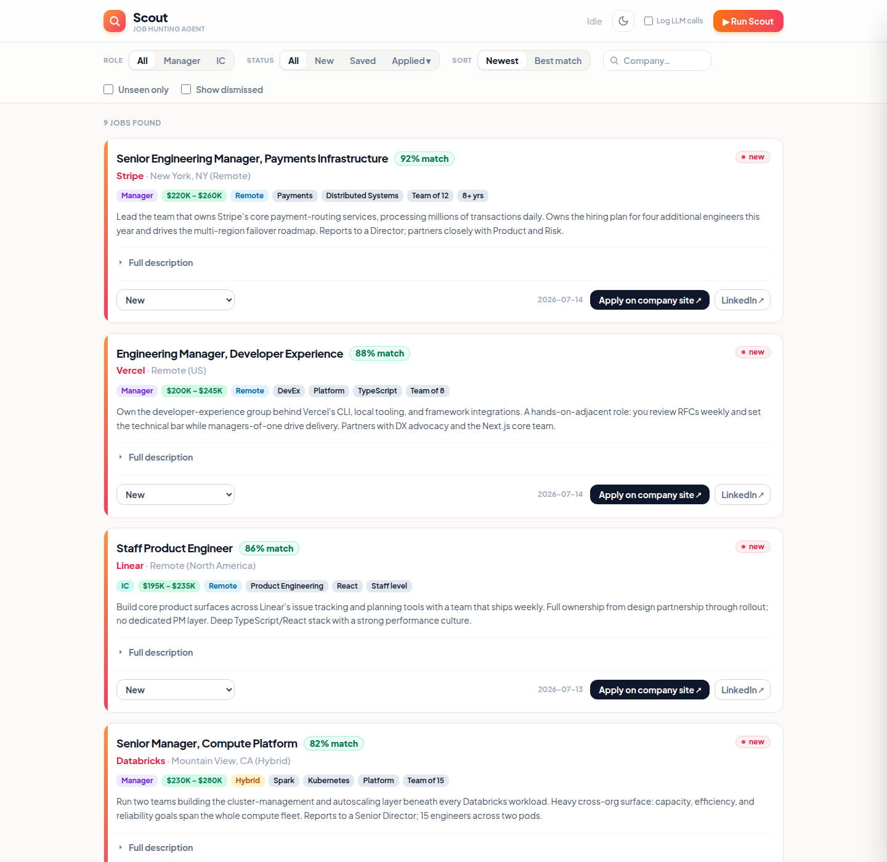
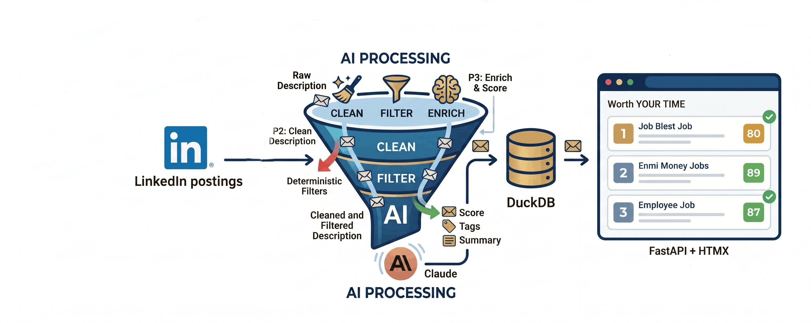
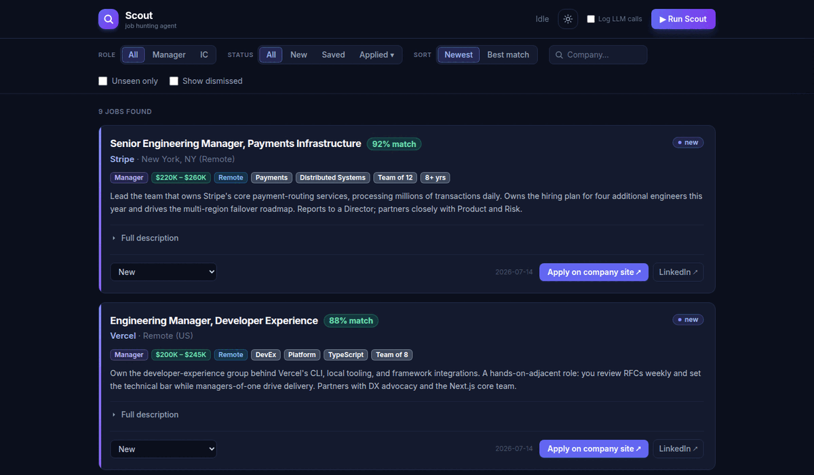
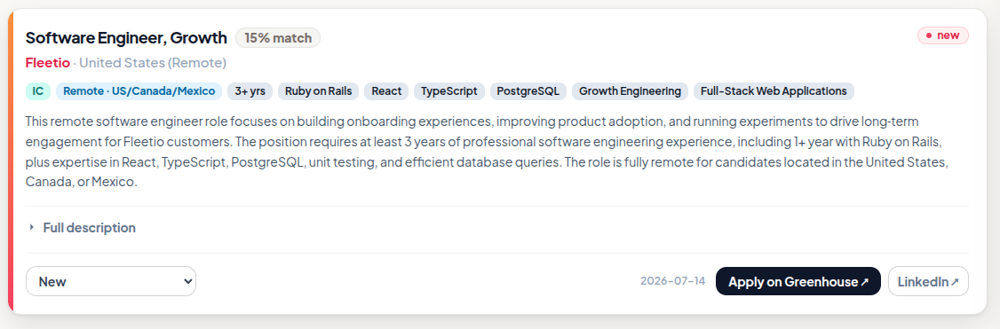
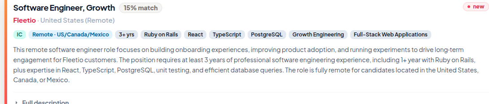
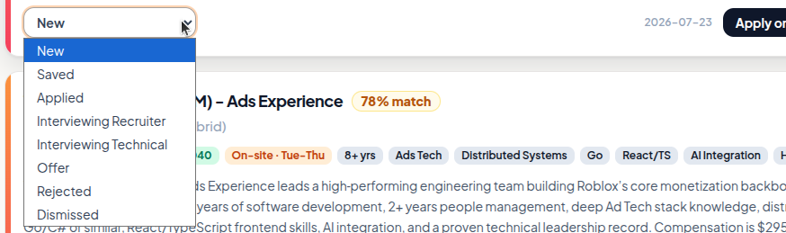
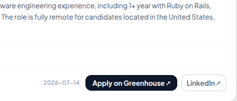
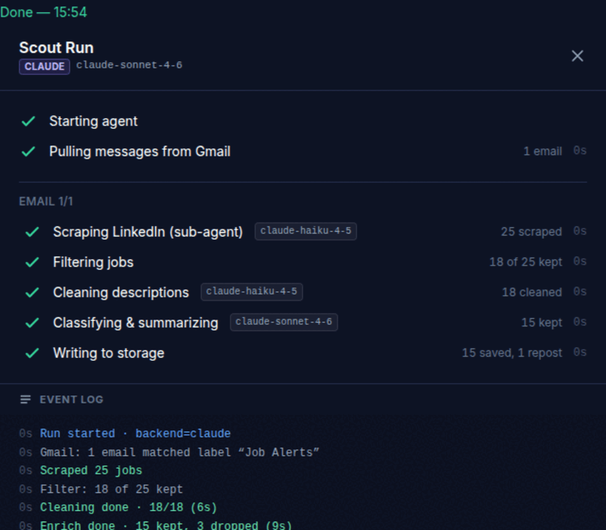

<div align="center">

<picture>
  <source media="(prefers-color-scheme: dark)" srcset="docs/images/banner_dark.svg">
  
</picture>

</div>

[](https://www.python.org/downloads/)
[](https://github.com/abraham-jacob/scout/actions/workflows/tests.yml)
[](https://github.com/abraham-jacob/scout/actions/workflows/tests.yml)
[](https://github.com/abraham-jacob/scout/branches)
[](LICENSE)
[](https://claude.com/claude-code)

**An AI agent that reads your LinkedIn job alerts, scrapes every posting behind them, and tells you which ones are actually worth your time.**

LinkedIn job search results are a firehose: dozens of postings a day, half of them reposts, mismatches, or roles you already applied to. Scout drinks from the firehose for you. It drives a real Chrome session to scrape **every** job behind each of your saved LinkedIn searches (including the ones LinkedIn never renders), cleans the boilerplate out of each description, classifies and scores every role against *your* resume and criteria, and files the survivors into a local database with a clean web UI — each job tagged, summarized, and scored out of 100.

Everything runs on your machine. Your resume, your criteria, and your job-search data never leave it — except as prompts to the LLM you choose (Claude API, or a fully local model via Ollama).



## Table of Contents

- [🎯 Why I Built This](#-why-i-built-this)
- [🧠 How It Works](#-how-it-works)
- [✨ Features](#-features)
- [📋 Requirements](#-requirements)
- [⚡ Quick Start](#-quick-start)
- [🖥️ Local LLM Backend](#-local-llm-backend)
- [⚙️ Configuration Reference](#-configuration-reference)
- [🔧 Engineering Notes](#-engineering-notes)
- [🧪 Testing & Evals](#-testing--evals)
- [💰 Costs](#-costs)
- [⚠️ Limitations & Responsible Use](#-limitations--responsible-use)
- [📄 License](#-license)

<br>

## 🎯 Why I Built This

I built Scout during my own job search. Every morning started with a stack of LinkedIn alert emails, and every posting meant the same ritual: open it, scroll past three paragraphs of EEO boilerplate, figure out if it's a real match, check whether I'd already seen it last week under a different posting ID. After a few weeks I realized I was doing the same mechanical classification task hundreds of times — which is exactly the kind of task you should hand to an agent. So I did.

<br>

## 🧠 How It Works



Scout is three LLM passes with cheap deterministic filtering in between, orchestrated by [`agent/runner.py`](agent/runner.py):

1. **Pass 1 — Browser scrape.** A Claude Haiku sub-agent drives your real Chrome session (via the [Claude in Chrome](https://claude.com/chrome) extension) to LinkedIn and pulls every job on the alert's first page through LinkedIn's internal Voyager API — title, company, full description, apply URL, applied status, and whether the posting is still live. No card-clicking, no screen-scraping heuristics, no missed virtualized cards.

2. **Deterministic filters.** Before spending another token, Scout drops jobs that are already in the database, already applied to, closed, or from companies you've excluded. Filtering is free; LLM calls aren't.

3. **Pass 2 — Clean.** One parallel LLM call per surviving job strips EEO statements, benefits marketing, and "About the Company" filler out of the raw description. What remains is the actual role.

4. **Pass 3 — Enrich & score.** One parallel LLM call per job classifies it into one of *your* configured role types (or drops it as `Other`), writes a 2–4 sentence summary, tags it (workplace, salary, stack, team size…), and scores it against your resume, per-role profile, and hard criteria — with dealbreakers capping the score. Results land in DuckDB; the web UI serves them with filtering, search, and an application-status pipeline.

The run drawer streams the whole pipeline live — per-pass timers, live progress counts, which model is doing what, and a scrolling event log of every job's outcome:



<br>

## ✨ Features

### 🔍 Easily sort and filter
Filter by role type, application status (including the full interview pipeline — Recruiter → Technical → Offer/Rejected), unseen-only, or company name with autocomplete search. Sort by newest or best match.


### 🗂️ Informative job cards
Every card surfaces what matters at a glance — title, company, location, salary range, and how it was posted (new vs. repost) — with the full original description one click away.



### 📝 Description summarization
No more scrolling past boilerplate. Every job gets a clean 2–4 sentence summary of the actual role, generated after the noise (EEO statements, benefits marketing, "About the Company" filler) is stripped out.



### 🏷️ Tagging
Each job is tagged with the details you'd otherwise dig for — workplace type, salary band, tech stack, team size, seniority — so you can scan a card instead of reading it.


### 🎯 Job match score
Every job is scored 0–100 against your resume, an optional per-role profile, and your hard criteria — with dealbreakers (like an unacceptable commute or on-site requirement) capping the score regardless of how good the rest of the fit is.


### 📌 Application pipeline tracking
Move a job through New → Saved → Applied → Interviewing (Recruiter/Technical) → Offer/Rejected right from its card. The status filter understands the whole pipeline, not just exact matches.



### 🔗 Direct apply links
Every card links straight to the fastest path to apply — the company's own site or Easy Apply — plus the original LinkedIn listing, with LinkedIn's safety-redirect wrapper unwrapped so the link goes where it says it does.



### 🖥️ Use Claude, or bring your own local LLM
Run the description-cleaning and enrichment passes on the Claude API for best-in-class quality, or point them at any OpenAI-compatible local server (Ollama, etc.) for a fully free, fully private run — no job description ever leaves your machine. Switch backends with one line in `profiles/config.toml`; the run drawer always shows exactly which backend and model did the work.



<br>

## 📋 Requirements

Scout is a personal, single-user tool. It expects:

| Requirement | Why |
|---|---|
| **Python 3.12** + [pipenv](https://pipenv.pypa.io/) | Runtime & dependency management |
| **Google Chrome** with the [Claude in Chrome](https://claude.com/chrome) extension | Pass 1 drives your real, logged-in browser |
| **[Claude Code](https://claude.com/claude-code)** (the `claude` CLI) | Pass 1 always runs on Claude; Passes 2–3 do too unless you point them at a local model |
| **A LinkedIn account** logged into Chrome | The scrape runs inside your own session, using your saved searches |
| *(Optional)* An OpenAI-compatible local server ([Ollama](https://ollama.com/) etc.) | Run Passes 2–3 on a local model: free and private |

<br>

## ⚡ Quick Start

```bash
git clone https://github.com/abraham-jacob/scout.git && cd scout
pipenv install
```

**1. Configure.** Create `profiles/config.toml` — [`profiles/README.md`](profiles/README.md) has a complete copyable example. A minimal config:

```toml
[[roles]]
name = "Manager"
definition = "Leads people. Titles like Engineering Manager, Senior EM, Director."
profile = "manager.md"          # optional per-role scoring profile in profiles/

[[roles]]
name = "IC"
definition = "Senior individual contributor. Titles like Staff/Principal Engineer."

[[linkedin_searches]]
name = "My Search"              # short alias shown in the run drawer/logs
url = "https://www.linkedin.com/jobs/search-results/?keywords=..."   # copied from LinkedIn

[filters]
exclude_companies = []          # dropped before any LLM call

[scoring]
fit_weight = 0.85               # must sum to 1 with criteria_weight
criteria_weight = 0.15
dealbreaker_cap = 30.0           # max score when a dealbreaker is present

[logging]
dir = "logs"

[llm]
backend = "claude"              # or "local" — see "Local LLM backend" below
max_workers = 4                 # Pass 2/3 parallelism
```

Then add your resume as `profiles/resume.md` (plus optional per-role profiles and a `criteria.md` with hard requirements — see [`profiles/README.md`](profiles/README.md)). Everything in `profiles/` except its README is git-ignored; your personal data stays local.

**2. Add your LinkedIn searches.** On LinkedIn, set up the job search(es) you want Scout to track. Copy each search's URL straight from your browser's address bar and add it to `[[linkedin_searches]]` in `profiles/config.toml` with a short `name` alias — no Gmail, no OAuth, no API keys.

**3. Prepare Chrome.** Install the Claude in Chrome extension, be logged into LinkedIn, and turn **off** *Settings → Downloads → "Ask where to save each file before downloading"* (Pass 1 hands off scraped data through a browser download — a save dialog would stall the agent).

**4. Run.**

```bash
pipenv run uvicorn app.main:app        # web UI at http://127.0.0.1:8000
```

Click **▶ Run Scout**. Or run the pipeline directly from the terminal:

```bash
pipenv run python -m agent.runner                   # scrape every configured search
pipenv run python -m agent.runner --url <linkedin_search_url>   # scrape one ad-hoc URL, ignoring config
```

<br>

## 🖥️ Local LLM Backend

Passes 2 and 3 — the headless text-in/JSON-out passes — can run on any OpenAI-compatible server instead of the Claude API. Pass 1 always runs on Claude, because it's an agentic browser task a local text model can't do.

```toml
[llm]
backend = "local"
max_workers = 1                 # tune to your GPU; a 16GB box may want 1

[llm.local]
base_url = "http://localhost:11434/v1"
model    = "gpt-oss:20b"        # must match the server's model id exactly
timeout  = 45                   # per-call seconds; stalls fail fast and retry

[llm.local.clean]               # optional per-pass request params,
reasoning_effort = "low"        # merged verbatim into the API call

[llm.local.enrich]
reasoning_effort = "medium"
```

The local path is built for imperfect hardware: Scout fires a warm-up request at run start so the model loads *before* the timed passes (with its own generous timeout and retries), keeps per-call timeouts tight so a stalled generation fails fast, and gives every failed call one parallel retry pass before falling back gracefully. Setup validation pings the server and verifies the model id before any browser work starts.

<br>

## ⚙️ Configuration Reference

All user configuration lives in `profiles/config.toml`, validated loudly at startup — no hidden defaults, so a typo can't silently change behavior.

| Section | Required | What it controls |
|---|---|---|
| `[[roles]]` | ✅ (≥1) | The role types jobs are classified into; drives prompts, scoring profiles, and UI filters |
| `[[linkedin_searches]]` | ✅ (≥1) | Named LinkedIn saved-search URLs scraped every run |
| `[filters]` | ✅ | Companies to drop before any LLM call |
| `[scoring]` | ✅ | Fit/criteria weights and the dealbreaker score cap |
| `[logging]` | ✅ | Log directory (daily app log + opt-in model-call log) |
| `[llm]` | ✅ | Backend (`claude` / `local`) and Pass 2/3 parallelism |
| `[llm.local]` | when local | Server URL, model, API key, timeout, per-pass params |
| `[scrape]` | optional | Browser download folder (defaults to `~/Downloads`) |

<br>

## 🔧 Engineering Notes

The parts of this project that were genuinely interesting to build:

**Getting 13 KB job descriptions out of a browser extension that blocks large returns.** The Claude in Chrome extension's privacy filter rejects large `javascript_tool` return values — and a page of job descriptions is far too big. Scout's scrape agent instead collects the batch in the page as `window.__jobs`, triggers a **blob download** of it as `scout_<run_id>.json`, and returns only a one-line status through the extension. The orchestrator polls the Downloads folder, reads the file, and deletes it. No shell steps anywhere in the handoff, so it works identically on Windows, macOS, and Linux.

**Scraping the API, not the DOM.** LinkedIn virtualizes its job list — most cards on a 25-job page never render, and DOM scraping misses them. Scout hits LinkedIn's internal Voyager job-postings API from inside your logged-in session instead, getting every field for every job in one batch: full description, apply URL, applied status, and listing state. Salary isn't in the API, so it's regex-parsed from the description text.

**Spending tokens where judgment lives.** Every architectural seam exists to avoid paying Sonnet prices for mechanical work: deterministic filters run before any LLM call; the scrape and clean passes run on Haiku; cleaning strips boilerplate *specifically so the Sonnet enrichment pass reads fewer input tokens*; and the parallel enrichment wave is preceded by one serial call plus a two-second pause — warming the Anthropic prompt cache so the parallel calls read the large shared system prompt from cache instead of each paying to write it. Every run prints its exact token usage and cost when it finishes.

**A subprocess progress protocol.** The web UI launches the pipeline as a subprocess and folds its stdout into live UI state: the runner emits `SCOUT_PROGRESS {json}` sentinel lines for every state change — pass transitions, per-job completions, log lines, which backend and models are active — and the FastAPI side reduces them into the run drawer that HTMX re-renders every second. Per-step timers, live *N of M* counts, and an honest event log (a failed call logs as a failure and its retry as a retry, not as silent success).

**Failing loudly, recovering quietly.** Config validation raises on the first problem instead of defaulting; setup checks verify the Claude CLI, resume, profile files, and local-LLM reachability before any browser work starts; each subprocess has a hard wall-clock kill; local-LLM calls get tight timeouts, one retry pass, and graceful fallbacks (a job that fails cleaning proceeds with its raw description rather than being dropped).

<br>

## 🧪 Testing & Evals

```bash
pipenv run unit-tests          # full suite, JUnit XML + branch coverage on agent/ and app/
pipenv run pytest              # same suite, no coverage — faster for local iteration
pipenv run pytest -m unit      # unit tests only
pipenv run pytest -m integration   # integration tests only
```

`pipenv run unit-tests` is what CI runs on every push and pull request (see the badges above) — use it before opening a PR. Coverage output goes to `htmlcov/` (open `htmlcov/index.html`) and `junit_xml_test_report.xml`; both are git-ignored.

The prompts are tested too: [`scripts/clean_prompt_test.py`](scripts/clean_prompt_test.py) and [`scripts/enrich_prompt_test.py`](scripts/enrich_prompt_test.py) run the real prompts against captured job descriptions and use an LLM-as-judge to score output quality — the harness that drove several rounds of prompt fixes (workplace-fabrication and either/or-requirement bugs among them).

<br>

## 💰 Costs

With the Claude backend, a run costs what the models cost: Haiku for the scrape and clean passes, Sonnet only for enrichment, prompt caching on, and the exact token usage and dollar cost printed at the end of every run. With the local backend, Passes 2–3 are free — Pass 1's Haiku scrape is the only API spend.

<br>

## ⚠️ Limitations & Responsible Use

- **Personal use, by design.** Scout automates *your own* browsing of *your own* saved searches, in *your own* logged-in Chrome session — one page of results per configured search, no crawling, no scale. Automated access may still conflict with LinkedIn's Terms of Service; understand them and use your judgment. This project is not affiliated with LinkedIn.
- **Single-user, local-only.** The web UI has no authentication and binds to localhost; run state lives in memory. Don't expose it to a network.
- **The browser is busy during Pass 1.** The scrape drives a real Chrome tab; grab a coffee — the run drawer will tell you exactly what's happening.

<br>

## 📄 License

[MIT](LICENSE) © 2026 Jacob Abraham
