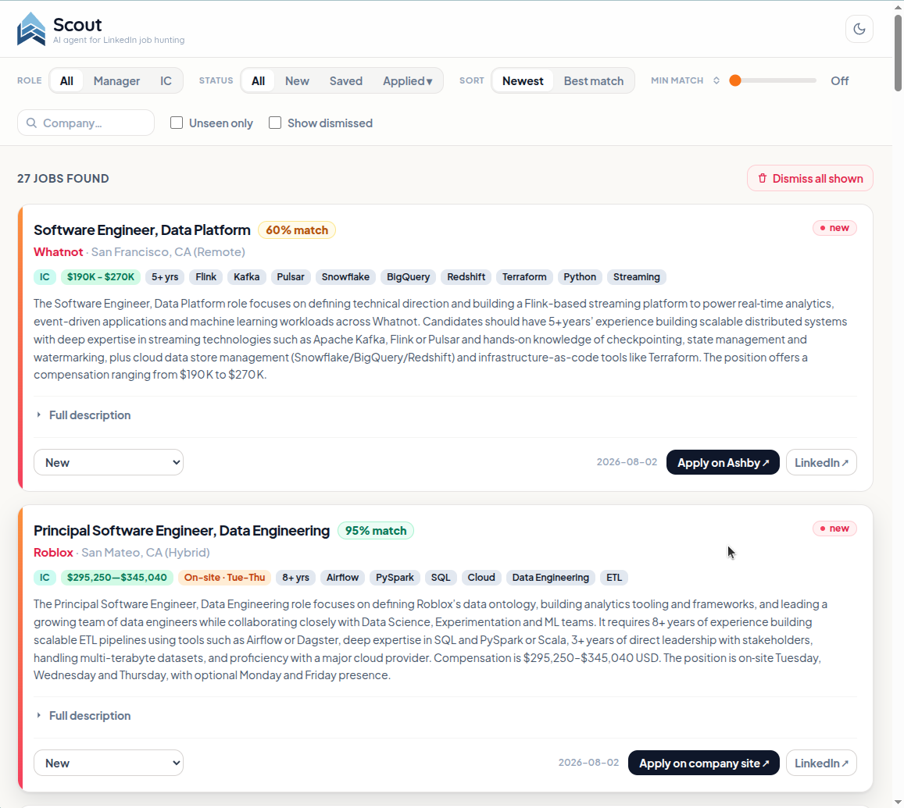
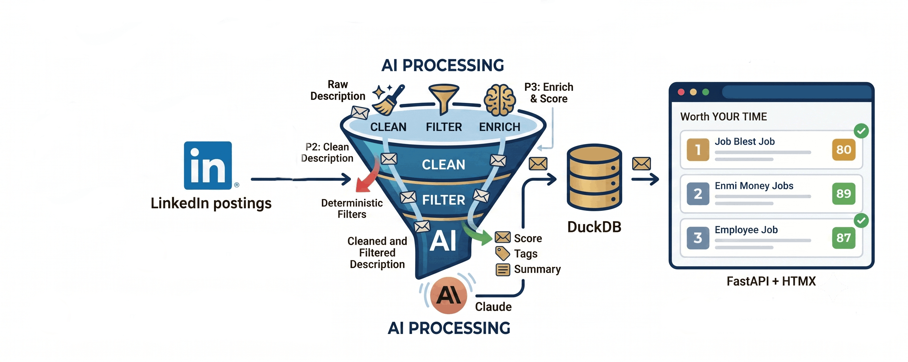
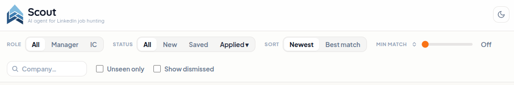
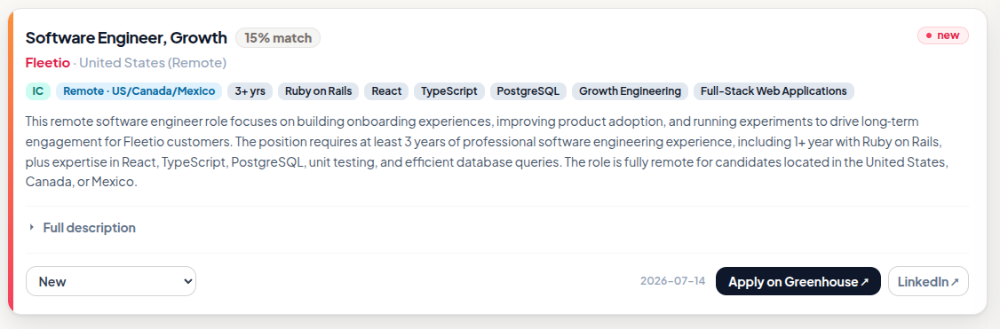
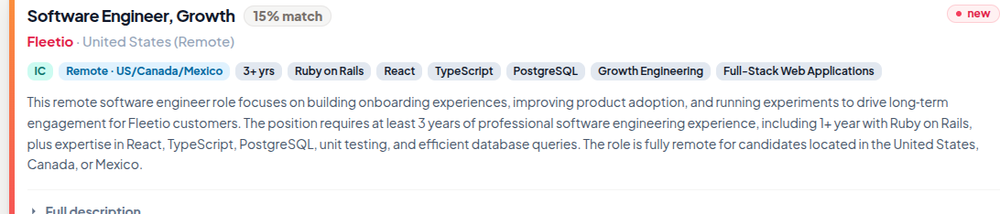
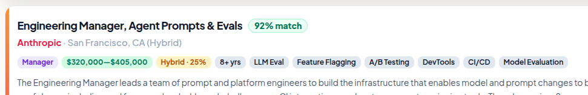
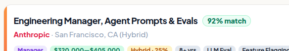
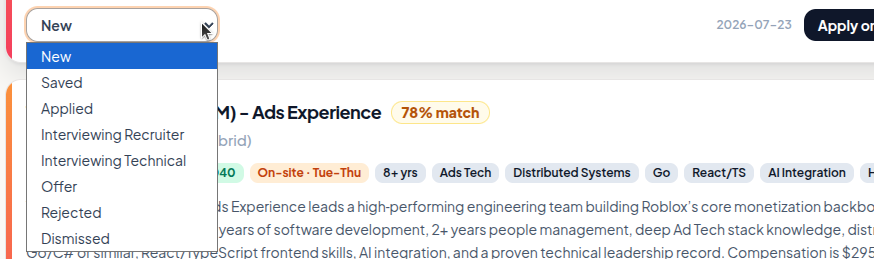
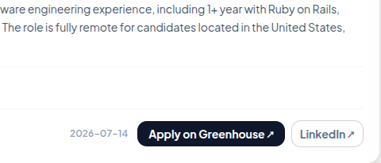

<div align="center">

<picture>
  <source media="(prefers-color-scheme: dark)" srcset="docs/images/banner_dark.svg">
  
</picture>

</div>

[](https://www.python.org/downloads/)
[](https://github.com/abraham-jacob/scout/actions/workflows/tests.yml)
[](https://github.com/abraham-jacob/scout/actions/workflows/tests.yml)
[](https://github.com/abraham-jacob/scout/branches)
[](LICENSE)
[](https://claude.com/claude-code)
[](https://abraham-jacob.github.io/scout/)
[](https://buymeacoffee.com/jacob.abraham)
<a href="https://ko-fi.com/L5B523RE16"></a>

**An AI agent that reads your LinkedIn job alerts, scrapes every posting behind them, and tells you which ones are actually worth your time.**

📖 **[Full documentation](https://abraham-jacob.github.io/scout/)** — setup, configuration reference, architecture, and troubleshooting.

LinkedIn job search results are a firehose: dozens of postings a day, half of them reposts, mismatches, or roles you already applied to. Scout drinks from the firehose for you. A companion browser extension scrapes **every** job behind each of your saved LinkedIn searches, right from your own logged-in session (including the ones LinkedIn never renders), then Scout cleans the boilerplate out of each description, classifies and scores every role against *your* resume and criteria, and files the survivors into a local database with a clean web UI — each job tagged, summarized, and scored out of 100.

Everything runs on your machine. Your resume, your criteria, and your job-search data never leave it — except as prompts to the LLM you choose (Claude API, or a fully local model via Ollama).



## Table of Contents

- [🎯 Why I Built This](#-why-i-built-this)
- [🧠 How It Works](#-how-it-works)
- [✨ Features](#-features)
- [📋 Requirements](#-requirements)
- [⚡ Quick Start](#-quick-start)
- [🔌 OpenAI-compatible Backend](#-openai-compatible-backend)
- [⚙️ Configuration Reference](#-configuration-reference)
- [🔧 Engineering Notes](#-engineering-notes)
- [🧪 Testing & Evals](#-testing--evals)
- [💰 Costs](#-costs)
- [⚠️ Limitations & Responsible Use](#-limitations--responsible-use)
- [❤️ Support This Project](#-support-this-project)
- [📄 License](#-license)

<br>

## 🎯 Why I Built This

I built Scout during my own job search. Every morning started with a stack of LinkedIn alert emails, and every posting meant the same ritual: open it, scroll past three paragraphs of EEO boilerplate, figure out if it's a real match, check whether I'd already seen it last week under a different posting ID. After a few weeks I realized I was doing the same mechanical classification task hundreds of times — which is exactly the kind of task you should hand to an agent. So I did.

<br>

## 🧠 How It Works



Scout is three LLM passes with cheap deterministic filtering in between, orchestrated by [`agent/runner.py`](agent/runner.py):

1. **Pass 1 — Browser scrape.** The companion **Scout browser extension** scrapes every job on the alert's first page through LinkedIn's internal Voyager API, from inside your own logged-in Chrome tab — title, company, full description, apply URL, applied status, and whether the posting is still live. No card-clicking, no screen-scraping heuristics, no missed virtualized cards, and no separate automated-browser session — it's your real session, so there's nothing for LinkedIn to flag as a bot.

2. **Deterministic filters.** Before spending another token, Scout drops jobs that are already in the database, already applied to, closed, or from companies you've excluded. Filtering is free; LLM calls aren't.

3. **Pass 2 — Clean.** One parallel LLM call per surviving job strips EEO statements, benefits marketing, and "About the Company" filler out of the raw description. What remains is the actual role.

4. **Pass 3 — Enrich & score.** One parallel LLM call per job classifies it into one of *your* configured role types (or drops it as `Other`), writes a 2–4 sentence summary, tags it (workplace, salary, stack, team size…), and scores it against your resume, per-role profile, and hard criteria — with dealbreakers capping the score. Results land in DuckDB; the web UI serves them with filtering, search, and an application-status pipeline.

The extension's popup streams Pass 1 live as it happens — which job it's fetching, live progress counts — then keeps streaming once Pass 2/3 pick up server-side, right through to a saved-jobs summary. *(Screenshot coming once the extension settles from a few more days of real use.)*

<br>

## ✨ Features

### 🔍 Easily sort and filter
Filter by role type, application status (including the full interview pipeline — Recruiter → Technical → Offer/Rejected), unseen-only, or company name with autocomplete search. Sort by newest or best match.



### 🗂️ Informative job cards
Every card surfaces what matters at a glance — title, company, location, salary range, and how it was posted (new vs. repost) — with the full original description one click away.



### 📝 Description summarization
No more scrolling past boilerplate. Every job gets a clean 2–4 sentence summary of the actual role, generated after the noise (EEO statements, benefits marketing, "About the Company" filler) is stripped out.



### 🏷️ Tagging
Each job is tagged with the details you'd otherwise dig for — workplace type, salary band, tech stack, team size, seniority — so you can scan a card instead of reading it.



### 🎯 Job match score
Every job is scored 0–100 against your resume, an optional per-role profile, and your hard criteria — with dealbreakers (like an unacceptable commute or on-site requirement) capping the score regardless of how good the rest of the fit is.



### 📌 Application pipeline tracking
Move a job through New → Saved → Applied → Interviewing (Recruiter/Technical) → Offer/Rejected right from its card. The status filter understands the whole pipeline, not just exact matches.



### 🔗 Direct apply links
Every card links straight to the fastest path to apply — the company's own site or Easy Apply — plus the original LinkedIn listing, with LinkedIn's safety-redirect wrapper unwrapped so the link goes where it says it does.



### 🖥️ Use Claude, or bring your own OpenAI-compatible model
Run the description-cleaning and enrichment passes on the Claude API for best-in-class quality, or point them at any OpenAI-compatible endpoint (Ollama, etc.) for a fully free, fully private run — no job description ever leaves your machine. Switch backends with one line in `profiles/config.toml`.

<br>

## 📋 Requirements

Scout is a personal, single-user tool. It expects:

| Requirement | Why |
|---|---|
| **Python 3.12** + [pipenv](https://pipenv.pypa.io/) | Runtime & dependency management |
| **Git** | To clone the repo |
| **Google Chrome** with the **Scout extension** (`extension/`, loaded unpacked — see Quick Start) | Pass 1 runs from your real, logged-in browser session |
| **A LinkedIn account** logged into Chrome | The scrape runs inside your own session, using your saved searches |
| **[Claude Code](https://claude.com/claude-code)** (the `claude` CLI) | Passes 2–3 run on it by default; not needed if you point them at an OpenAI-compatible model instead |
| *(Optional)* An OpenAI-compatible server ([Ollama](https://ollama.com/) etc.) | Run Passes 2–3 on that model: free and private |

<br>

## ⚡ Quick Start

```bash
git clone https://github.com/abraham-jacob/scout.git && cd scout
pipenv install
```

**1. Configure.** Create `profiles/config.toml` — [`profiles/README.md`](profiles/README.md) has a complete copyable example. A minimal config:

```toml
[[roles]]
name = "Manager"
definition = "Leads people. Titles like Engineering Manager, Senior EM, Director."
profile = "manager.md"          # optional per-role scoring profile in profiles/

[[roles]]
name = "IC"
definition = "Senior individual contributor. Titles like Staff/Principal Engineer."

[[linkedin_searches]]
name = "My Search"              # short alias shown in the extension popup/logs
url = "https://www.linkedin.com/jobs/search-results/?keywords=..."   # copied from LinkedIn

[filters]
exclude_companies = []          # dropped before any LLM call

[scoring]
fit_weight = 0.85               # must sum to 1 with criteria_weight
criteria_weight = 0.15
dealbreaker_cap = 30.0           # max score when a dealbreaker is present

[logging]
dir = "logs"

[llm]
backend = "claude"              # or "api" — see "OpenAI-compatible Backend" below
max_workers = 4                 # Pass 2/3 parallelism
```

Then add your resume as `profiles/resume.md` (plus optional per-role profiles and a `criteria.md` with hard requirements — see [`profiles/README.md`](profiles/README.md)). Everything in `profiles/` except its README is git-ignored; your personal data stays local.

**2. Add your LinkedIn searches.** On LinkedIn, set up the job search(es) you want Scout to track. Copy each search's URL straight from your browser's address bar and add it to `[[linkedin_searches]]` in `profiles/config.toml` with a short `name` alias — no Gmail, no OAuth, no API keys.

**3. Load the extension.** In Chrome, go to `chrome://extensions`, enable **Developer mode** (top right), click **Load unpacked**, and select the `extension/` folder from your clone. Make sure you're logged into LinkedIn in that same browser.

**4. Run.**

```bash
pipenv run uvicorn app.main:app        # web UI at http://127.0.0.1:8000 — job list + the API the extension talks to
```

With the server running, click the Scout icon in Chrome's toolbar. The popup lists your configured searches (each with a **Run** button), a **Custom Search** box (paste any LinkedIn search/job URL or job id), and **Scrape Current Page** (harvests whatever LinkedIn jobs page you're already on). Progress streams live in the popup through all three passes.

You can still run the pipeline directly from the terminal too — this uses the older CDP-driven scrape path, kept as a fallback:

```bash
pipenv run python -m agent.runner                   # scrape every configured search
pipenv run python -m agent.runner --url <linkedin_search_url>   # scrape one ad-hoc URL, ignoring config
```

<br>

## 🔌 OpenAI-compatible Backend

Passes 2 and 3 — the headless text-in/JSON-out passes — can run on any **OpenAI-compatible** server instead of the Claude API: [Ollama](https://ollama.com) running on your own box is the common case (free, fully private), but the same config also works with a remote OpenAI-compatible API (e.g. [Kimi](https://www.moonshot.ai/)) if you'd rather not run a server yourself. Pass 1 doesn't touch an LLM at all — it's plain JavaScript in the browser extension — so this setting has no effect on it either way.

```toml
[llm]
backend = "api"
max_workers = 1                 # tune to your GPU; a 16GB box may want 1

[llm.api]
base_url = "http://localhost:11434/v1"
model    = "gpt-oss:20b"        # must match the server's model id exactly
timeout  = 45                   # per-call seconds; stalls fail fast and retry

[llm.api.clean]                 # optional per-pass request params,
reasoning_effort = "low"        # merged verbatim into the API call

[llm.api.enrich]
reasoning_effort = "medium"
```

This path is built for imperfect hardware: Scout fires a warm-up request at run start so a self-hosted model loads *before* the timed passes (with its own generous timeout and retries), keeps per-call timeouts tight so a stalled generation fails fast, and gives every failed call one parallel retry pass before falling back gracefully. Setup validation pings the server and verifies the model id before any browser work starts.

<br>

## ⚙️ Configuration Reference

All user configuration lives in `profiles/config.toml`, validated loudly at startup — no hidden defaults, so a typo can't silently change behavior. Required sections cover roles, LinkedIn searches, filters, scoring, logging, and the LLM backend; see the full [Configuration reference](https://abraham-jacob.github.io/scout/getting-started/) in the docs for every field.

<br>

## 🔧 Engineering Notes

A few of the parts that were genuinely interesting to build: a browser extension that scrapes from *inside* your real session instead of driving an automated one — no CDP fingerprint, sequential jittered requests instead of a burst, hard-halt-and-resume the moment LinkedIn pushes back — scraping LinkedIn's internal API instead of its DOM, and spending LLM tokens only where judgment actually lives. (An earlier version drove Chrome via CDP automation and got flagged; the extension rewrite fixed that.) Full writeup in the [Architecture docs](https://abraham-jacob.github.io/scout/architecture/).

<br>

## 🧪 Testing & Evals

```bash
pipenv run unit-tests          # full suite, JUnit XML + branch coverage on agent/ and app/
pipenv run pytest              # same suite, no coverage — faster for local iteration
pipenv run pytest -m unit      # unit tests only
pipenv run pytest -m integration   # integration tests only
```

`pipenv run unit-tests` is what CI runs on every push and pull request (see the badges above) — use it before opening a PR. Coverage output goes to `htmlcov/` (open `htmlcov/index.html`) and `junit_xml_test_report.xml`; both are git-ignored.

The prompts are tested too: [`scripts/clean_prompt_test.py`](scripts/clean_prompt_test.py) and [`scripts/enrich_prompt_test.py`](scripts/enrich_prompt_test.py) run the real prompts against captured job descriptions and use an LLM-as-judge to score output quality — the harness that drove several rounds of prompt fixes (workplace-fabrication and either/or-requirement bugs among them).

<br>

## 💰 Costs

With the Claude backend, a run costs what the models cost: Haiku for the scrape and clean passes, Sonnet only for enrichment, prompt caching on, and the exact token usage and dollar cost printed at the end of every run. With the api backend, Passes 2–3 aren't metered by Scout — Pass 1's Haiku scrape is the only guaranteed API spend (a remote OpenAI-compatible endpoint may still bill you for its own usage).

<br>

## ⚠️ Limitations & Responsible Use

- **Personal use, by design.** Scout automates *your own* browsing of *your own* saved searches, in *your own* logged-in Chrome session — one page of results per configured search, no crawling, no scale, and requests to LinkedIn go out slowly and one at a time (jittered, not a burst) rather than as fast as possible. Automated access may still conflict with LinkedIn's Terms of Service; understand them and use your judgment. This project is not affiliated with LinkedIn.
- **Single-user, local-only.** The web UI has no authentication and binds to localhost; run state lives in memory. Don't expose it to a network.
- **A scrape takes a few minutes, by design.** Requests are deliberately paced, not fired as fast as possible — the extension popup shows exactly what's happening the whole time. Saved-search runs open a background tab rather than taking over your active one, so you can keep browsing while it works.

<br>

## ❤️ Support This Project

Scout is free, open source, and built on nights and weekends. If it helped you land your next role (or just saved you from scrolling past EEO boilerplate one more time), consider buying me a coffee — it genuinely helps keep projects like this maintained.

<a href="https://www.buymeacoffee.com/jacob.abraham" target="_blank"></a>
<a href="https://ko-fi.com/jacobabraham" target="_blank"></a>

Made with ❤️ by [Jacob Abraham](https://github.com/abraham-jacob).

<br>

## 📄 License

[MIT](LICENSE) © 2026 Jacob Abraham
