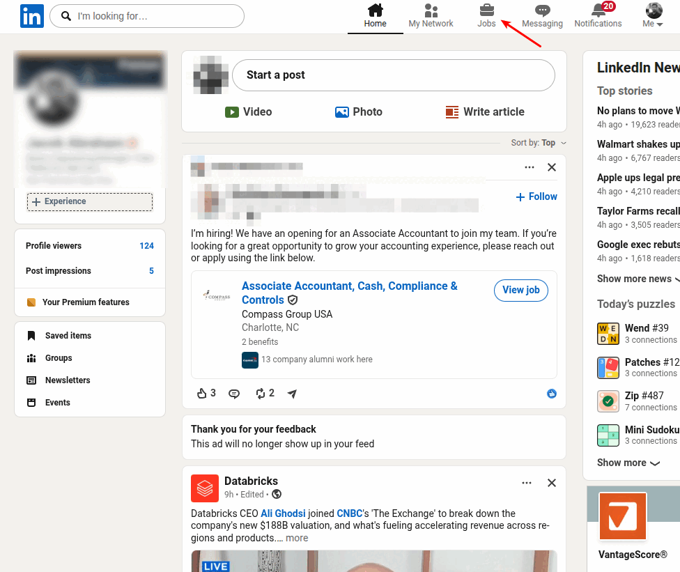

# Configuration

## Requirements

Scout is a personal, single-user tool. It expects:

| Requirement | Why |
|---|---|
| **Python 3.12** + [pipenv](https://pipenv.pypa.io/) | Runtime & dependency management |
| **Git** | To clone the repo |
| **Google Chrome** with the [Claude in Chrome](https://claude.com/chrome) extension | Pass 1 drives your real, logged-in browser |
| **[Claude Code](https://claude.com/claude-code)** (the `claude` CLI) | Pass 1 always runs on Claude; Passes 2–3 do too unless you point them at a local model |
| **A LinkedIn account** logged into Chrome | The scrape runs inside your own session |
| **A Gmail account** receiving LinkedIn job-alert emails, plus a Google Cloud OAuth client (`credentials.json`) with the Gmail API enabled | Scout reads the alert emails to find the job URLs |
| *(Optional)* An OpenAI-compatible local server ([Ollama](https://ollama.com/) etc.) | Run Passes 2–3 on a local model: free and private |

## 1. Clone and install

```bash
git clone https://github.com/abraham-jacob/scout.git && cd scout
pipenv install
```

## 2. External dependencies

Scout leans on three outside accounts before it can run end-to-end. Set
these up once, in any order.

### Claude Code

Scout's browser scrape (Pass 1) always runs on Claude, and the enrichment
passes do too unless you switch to a local backend. Sign up at claude.com to
get Claude Code access with all the models Scout uses (Haiku and Sonnet).

!!! tip "You need a paid Claude plan"
    Claude Code requires a [subscription](https://claude.com/pricing) — the
    **$20/month Pro plan** is enough to run Scout end-to-end.

Then:

- Install the [`claude` CLI (Claude Code)](https://docs.claude.com/en/docs/claude-code/quickstart) and confirm it runs (`claude --version`).
- Install the [Claude in Chrome](https://claude.com/chrome) extension —
  Pass 1 drives your browser through it.
- Turn **off** *Chrome Settings → Downloads → "Ask where to save each file
  before downloading"*. Pass 1 hands scraped data off through a browser
  download; a save dialog would stall the agent. See the [FAQ](faq.md) if
  you hit this.

### LinkedIn account

There are two distinct tasks here — one you do once during setup, one every
time you run Scout:

- **One-time — set up job alerts.**

    !!! tip "Set up job alerts"
        Set up job alerts (or a saved search with email alerts on) for the
        searches you want Scout to track, so LinkedIn starts emailing you
        postings on a schedule. Those alert emails are what Scout reads in
        the next step.

    

- **Every run — stay logged into LinkedIn in Chrome.**

    !!! warning "Stay logged into LinkedIn in Chrome"
        Before running Scout, make sure Chrome has a tab open where you're
        actively logged into LinkedIn with your own credentials — the
        scrape runs inside that session, not a headless one.

### Gmail account

Scout finds job postings by reading the LinkedIn alert emails that land in
Gmail, so it needs read access to that inbox:

- In [Google Cloud Console](https://console.cloud.google.com/), enable the
  Gmail API and create an OAuth *Desktop app* client. Save the downloaded
  JSON as `credentials.json` in the repo root.
- In Gmail, create a filter that applies a label (e.g. `Job Alerts`) to the
  LinkedIn job-alert emails from the searches you set up above — that label
  is what you'll reference as `[gmail] label` in the next step.
- The first run opens a browser window for the OAuth consent flow; after
  that, the token is cached locally (`token.json`).

## 3. Configure

All user configuration lives in `profiles/config.toml`, loaded and validated
by `app/config.py::load_config`. It is **required**, with no in-code
defaults — a typo or missing field fails loudly at startup instead of
silently changing behavior.

Everything under `profiles/` except its own `README.md` is git-ignored —
these files hold personal data (resume, scoring criteria) and never leave
your machine.

A minimal config looks like this:

```toml
[[roles]]
name = "Manager"
definition = "Leads people. Titles like Engineering Manager, Senior EM, Director."
profile = "manager.md"          # optional per-role scoring profile in profiles/

[[roles]]
name = "IC"
definition = "Senior individual contributor. Titles like Staff/Principal Engineer."

[gmail]
label = "Job Alerts"            # the Gmail label your LinkedIn alerts land under

[filters]
exclude_companies = []          # dropped before any LLM call

[scoring]
fit_weight = 0.85               # must sum to 1 with criteria_weight
criteria_weight = 0.15
dealbreaker_cap = 30.0           # max score when a dealbreaker is present

[logging]
dir = "logs"

[llm]
backend = "claude"              # or "local" — see the Local LLM Backend page
max_workers = 4                 # Pass 2/3 parallelism
```

### Section overview

| Section | Required | What it controls |
|---|---|---|
| `[[roles]]` | ✅ (≥1) | The role types jobs are classified into; drives prompts, scoring profiles, and UI filters |
| `[gmail]` | ✅ | The Gmail label your alert emails live under |
| `[filters]` | ✅ | Companies to drop before any LLM call |
| `[scoring]` | ✅ | Fit/criteria weights and the dealbreaker score cap |
| `[logging]` | ✅ | Log directory (daily app log + opt-in model-call log) |
| `[llm]` | ✅ | Backend (`claude` / `local`) and Pass 2/3 parallelism |
| `[llm.local]` | when `backend = "local"` | Server URL, model, API key, timeout |
| `[llm.local.clean]` / `[llm.local.enrich]` | optional | Per-pass request params merged into the local backend's chat-completion call |
| `[scrape]` | optional | Browser download folder (defaults to `~/Downloads`) |

### `[gmail]`, `[filters]`, `[scoring]`, `[logging]`, `[scrape]`

```toml
[gmail]
label = "Daily LinkedIn Search"   # the label your job-alert emails live under

[filters]
exclude_companies = ["Capital One"]   # dropped before any LLM call; [] is fine

[scoring]
fit_weight = 0.85        # weights must sum to 1
criteria_weight = 0.15
dealbreaker_cap = 30.0   # score ceiling (0-100) when a dealbreaker is hit

[logging]
dir = "~/.local/state/scout/logs"   # daily app log + opt-in model-call log;
                                    # ~ expands, relative paths = project root

[scrape]                            # OPTIONAL — omit unless you've changed
download_dir = "~/Downloads"        # Chrome's download folder. Defaults to
                                    # ~/Downloads (works on Win/Mac/Linux).
```

### `[llm]` — pick the backend and its parallelism (required)

`backend` says which model backend runs the two headless passes —
description cleaning (Pass 2) and enrichment/scoring (Pass 3). There's no
default: you must state `"claude"` or `"local"` explicitly, so the config
always says which one is in use. Pass 1 (the browser scrape) always runs on
Claude — it drives the browser and can't move to a local text model.

`max_workers` is the width of the Pass 2/3 worker pool (a positive integer).
Tune it to the active backend: a Claude run can go wide (bounded mainly by
prompt-cache-write dedup, default 2), while a local server is bounded by its
own VRAM/throughput — a 16GB box running a 20B model may only manage
`max_workers = 1`.

```toml
[llm]
backend = "claude"
max_workers = 4
```

#### `[llm.local]` — routing Passes 2–3 to a local server

Set `backend = "local"` to route both headless passes to a **local
OpenAI-compatible server** such as [Ollama](https://ollama.com), cutting API
cost to zero for them. It's all-or-nothing: both passes move together.

```toml
[llm]
backend = "local"
max_workers = 1                             # local box; keep it low

[llm.local]
base_url = "http://192.168.1.50:11434/v1"   # your server's OpenAI-compatible endpoint
model    = "scout-enrich:latest"             # EXACT id from the server's model list
# api_key = "ollama"    # optional; Ollama ignores it, other servers may need it
# timeout = 300         # optional, seconds (default 300) — local inference can be slow
```

`base_url` and `model` are required in this mode. `model` must be the
**exact id the server reports**, including any tag — Ollama lists models as
`name:tag` (e.g. `scout-enrich:latest`, from `ollama list`), so
`scout-enrich` alone won't match; other OpenAI-compatible servers (vLLM, LM
Studio) report ids with no tag at all. Whatever the server's model list
shows, copy it verbatim.

At startup the pipeline probes the server and refuses to run if it's
unreachable **or** isn't serving that exact `model` id, so a wrong host, a
stopped server, or a mistyped/un-pulled model fails fast instead of mid-run
— and the error prints the ids the server currently serves so you can copy
the right one.

#### Per-pass request parameters (optional)

Two optional sub-tables let you pass request parameters to the server per
pass — `[llm.local.clean]` for description cleaning (Pass 2) and
`[llm.local.enrich]` for enrichment/scoring (Pass 3). Each key/value is
merged **verbatim** into that pass's chat-completion JSON, so you can set
anything the server accepts. The motivating case is a reasoning model like
GPT-OSS: give the mechanical cleaning pass low effort and the scoring pass
high effort.

```toml
[llm.local.clean]
temperature = 0
reasoning_effort = "low"      # cleaning is mechanical — don't burn thinking on it

[llm.local.enrich]
temperature = 0
reasoning_effort = "high"     # scoring is judgment — let it think
```

Both tables are optional, as is every key inside them. Omit them and the
pipeline sends only JSON-output mode — temperature and any reasoning knob
fall back to the **server/model default** (Scout doesn't force
`temperature = 0`; set it explicitly here if you want it). Values must be
scalars (string/number/boolean). The pipeline owns `model`, `messages`, and
`stream`, so those keys are rejected here. Parameter *values* aren't
validated — an unsupported one (a `reasoning_effort` a non-reasoning model
doesn't understand, say) is left for the server to reject.

See [Local LLM Backend](local-llm.md) for the full picture, including
warm-up and retry behavior.

### `[[roles]]`

Defines the role types Scout keeps. Each `[[roles]]` entry has a `name` (the
label stored in the DB and shown in the UI), a `definition` (classification
guidance for the enrichment model — what counts, example titles, explicit
exclusions), and an optional `profile` (a markdown file in `profiles/` the
role is scored against). Jobs matching no configured role are classified
`Other` and dropped. Chip and filter colors are assigned automatically in
the order roles are listed.

The file must exist and define **at least one** role — with zero roles
there is nothing for Scout to keep, so the pipeline (and the web UI) refuse
to run. There are no built-in default roles.

```toml
[[roles]]
name = "Product Manager"
definition = """the core of the job is owning product strategy and \
execution... Examples: Product Manager, Senior/Group PM, Director of \
Product. Project/program management does not count."""
profile = "profile_pm.md"   # optional — omit to score on the resume alone
```

### Scoring files

`resume.md` is **required** — the pipeline refuses to start without it, and
every kept job is scored against it. Per-role profiles are optional
refinements on top: a role with one is scored against resume + profile, a
role without one against the resume alone. A profile that is referenced in
`config.toml` but missing on disk is a setup error and also stops the run.

| File | Contents |
|---|---|
| `resume.md` | **Required.** Your latest resume, converted to markdown / plain text. |
| `profile_<role>.md` | Optional, one per role (referenced from `config.toml`): what you are looking for in that kind of role — level, kind of work, technologies, scope. Jobs of a role with no profile are scored against the resume alone. |
| `criteria.md` | Optional. Preferences outside the resume: workplace, compensation, domains to seek/avoid, company stage. Drives the `criteria_weight` share of the final score (the rest is resume+profile fit). Without this file the score is 100% fit. |

Mark any criteria line as a hard veto by prefixing it with
`**DEALBREAKER**:` — jobs violating one are capped at `dealbreaker_cap` no
matter how well they fit, and the violated item is shown on the job card.
Example:

```markdown
## Workplace
- Remote strongly preferred; Hybrid up to 2 days is fine
- **DEALBREAKER**: On-site 4+ days a week

## Domains to avoid
- Ad Tech (soft penalty)
- **DEALBREAKER**: Crypto / Web3
```

### After adding or editing files

- **New scrape runs** score automatically.
- **Existing jobs**: run `pipenv run python -m scripts.backfill_scores`
  (one Sonnet call per unscored job; updates only the scoring columns).
- **Changed your mind about weights or the cap?**
  `pipenv run python -m scripts.backfill_scores --recompute` rebuilds every
  final score from the stored subscores with zero LLM calls.

## 4. Run

```bash
pipenv run uvicorn app.main:app        # web UI at http://127.0.0.1:8000
```

Click **▶ Run Scout**. Or run the pipeline directly from the terminal:

```bash
pipenv run python -m agent.runner                   # process unread alert emails
pipenv run python -m agent.runner --url <linkedin_search_url>   # scrape one URL, skip Gmail
```

From here: read [Using the Web UI](web-ui.md) to see what a run produces, or
[Architecture](architecture.md) for how the pipeline works under the hood.
