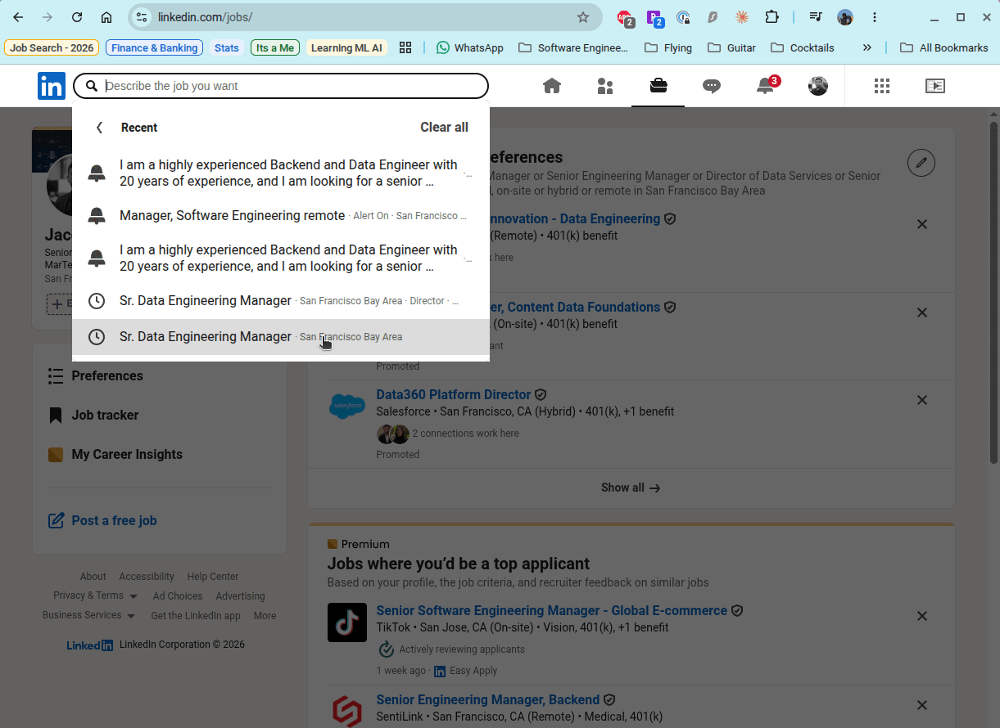
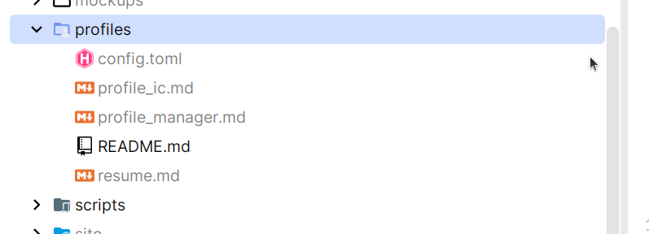

# Configuration

## Requirements

Scout is a personal, single-user tool. Before you start, make sure you have:

| Requirement | Why |
|---|---|
| **:simple-python:{ .python } Python 3.12** + [pipenv](https://pipenv.pypa.io/) | Runtime & dependency management |
| **:simple-git:{ .git } Git** | To clone the repo |
| **:simple-googlechrome:{ .chrome } Google Chrome** with the [Claude in Chrome](https://claude.com/chrome) extension | Pass 1 drives your real, logged-in browser |
| **:simple-claude:{ .claude } [Claude Code](https://claude.com/claude-code)** (the `claude` CLI) | Pass 1 always runs on Claude; Passes 2–3 do too unless you point them at a local model |
| **:fontawesome-brands-linkedin:{ .linkedin } A LinkedIn account** logged into Chrome | The scrape runs inside your own session, using your saved searches |
| *(Optional)* An OpenAI-compatible local server (:simple-ollama: [Ollama](https://ollama.com/) etc.) | Run Passes 2–3 on a local model: free and private |

## The setup journey

Five steps, done once (steps 3–4 you'll revisit as your search evolves):

<div class="st-steps" markdown>

<div class="st-step" markdown>
<div class="st-step-num">1</div>
<span class="st-step-kicker">Install</span>
### :material-download: Clone & install

```bash title="Terminal"
git clone https://github.com/abraham-jacob/scout.git && cd scout
pipenv install
```

</div>

<div class="st-step" markdown>
<div class="st-step-num">2</div>
<span class="st-step-kicker">Connect accounts</span>
### :simple-claude:{ .claude } Connect Claude Code

Scout's browser scrape (Pass 1) always runs on Claude, and the enrichment
passes do too unless you switch to a local backend. Sign up at claude.com to
get Claude Code access with all the models Scout uses (Haiku and Sonnet).

!!! tip "You need a paid Claude plan"
    Claude Code requires a [subscription](https://claude.com/pricing) — the
    **$20/month Pro plan** is enough to run Scout end-to-end.

Then:

- Install the [`claude` CLI (Claude Code)](https://docs.claude.com/en/docs/claude-code/quickstart) and confirm it runs (`claude --version`).
- Install the [Claude in Chrome](https://claude.com/chrome) extension —
  Pass 1 drives your browser through it.
- Turn **off** *Chrome Settings → Downloads → "Ask where to save each file
  before downloading"*. Pass 1 hands scraped data off through a browser
  download; a save dialog would stall the agent. See the [FAQ](faq.md) if
  you hit this.

</div>

<div class="st-step" markdown>
<div class="st-step-num">3</div>
<span class="st-step-kicker">Configure</span>
### :material-file-cog: Configure Scout

All your settings live in the `profiles/` directory. Everything under it
except its own `README.md` is git-ignored — these files hold personal data
(resume, scoring criteria, saved searches) and never leave your machine. It
holds two kinds of file, `config.toml` (this step) and markdown scoring
files (the next step).

`config.toml` is loaded and validated by `app/config.py::load_config`. It is
**required**, with no in-code defaults — a typo or missing field fails
loudly at startup instead of silently changing behavior.

A minimal config looks like this:

```toml title="TOML"
[[roles]]
name = "Manager"
definition = "Leads people. Titles like Engineering Manager, Senior EM, Director."
profile = "manager.md"          # optional per-role scoring profile in profiles/

[[linkedin_searches]]
name = "My Search"               # short alias shown in the run drawer/logs
url = "https://www.linkedin.com/jobs/search-results/?keywords=..."   # copied from LinkedIn

[filters]
exclude_companies = []          # dropped before any LLM call

[scoring]
fit_weight = 0.85               # must sum to 1 with criteria_weight
criteria_weight = 0.15
dealbreaker_cap = 30.0           # max score when a dealbreaker is present

[logging]
dir = "logs"

[llm]
backend = "claude"              # or "local" — see the OpenAI-compatible Backend page
max_workers = 4                 # Pass 2/3 parallelism
```

#### Section overview

| Section | Required | What it controls |
|---|---|---|
| `[[roles]]` | ✅ (≥1) | The role types jobs are classified into; drives prompts, scoring profiles, and UI filters |
| `[[linkedin_searches]]` | ✅ (≥1) | Named LinkedIn saved-search URLs scraped every run |
| `[filters]` | ✅ | Companies to drop before any LLM call |
| `[scoring]` | ✅ | Fit/criteria weights and the dealbreaker score cap |
| `[logging]` | ✅ | Log directory (daily app log + opt-in model-call log) |
| `[llm]` | ✅ | Backend (`claude` / `local`) and Pass 2/3 parallelism |
| `[llm.local]` | when `backend = "local"` | Server URL, model, API key, timeout |
| `[llm.local.clean]` / `[llm.local.enrich]` | optional | Per-pass request params merged into the local backend's chat-completion call |
| `[scrape]` | optional | Browser download folder (defaults to `~/Downloads`) |

#### Pick the backend & its parallelism — `[llm]`

```toml title="TOML"
[llm]
backend = "claude"
max_workers = 4
```

| Field | Required | Notes |
|---|---|---|
| `backend` | ✅ | `"claude"` or `"local"` — no default, so the config always states which one is in use. Only Passes 2–3 move; Pass 1 (the browser scrape) always runs on Claude |
| `max_workers` | ✅ | Width of the Pass 2/3 worker pool. Claude can go wide (bounded mainly by prompt-cache-write dedup, default 2); a local server is bounded by its own VRAM/throughput — a 16GB box running a 20B model may only manage `max_workers = 1` |

??? note ":material-server-network: Routing Passes 2–3 to a local server — `[llm.local]`"

    !!! warning
        Configuring a local LLM server is outside the scope of this manual.

    Set `backend = "local"` to route both headless passes to a **local
    OpenAI-compatible server** such as [Ollama](https://ollama.com), cutting
    API cost to zero for them. It's all-or-nothing: both passes move
    together.

    ```toml title="TOML"
    [llm]
    backend = "local"
    max_workers = 1                             # local box; keep it low

    [llm.local]
    base_url = "http://192.168.1.50:11434/v1"   # your server's OpenAI-compatible endpoint
    model    = "scout-enrich:latest"             # EXACT id from the server's model list
    # api_key = "ollama"    # optional; Ollama ignores it, other servers may need it
    # timeout = 300         # optional, seconds (default 300) — local inference can be slow
    ```

    | Field | Required | Notes |
    |---|---|---|
    | `base_url` | ✅ | Your server's OpenAI-compatible endpoint |
    | `model` | ✅ | Exact id from the server's model list — copy it verbatim, including any tag (Ollama: `name:tag`, e.g. `scout-enrich:latest`; `scout-enrich` alone won't match) |
    | `api_key` | optional | Ignored by Ollama; other servers may require it |
    | `timeout` | optional | Seconds, default `300` — local inference can be slow |

    At startup the pipeline probes the server and refuses to run if it's
    unreachable or isn't serving that exact `model` id — a wrong host, a
    stopped server, or a mistyped/un-pulled model fails fast instead of
    mid-run, and the error prints the ids the server actually serves.

??? note ":material-tune-variant: Per-pass request parameters (optional) — `[llm.local.clean]` / `[llm.local.enrich]`"

    Two optional sub-tables let you pass request parameters to the server
    per pass — `[llm.local.clean]` for description cleaning (Pass 2) and
    `[llm.local.enrich]` for enrichment/scoring (Pass 3). Each key/value is
    merged **verbatim** into that pass's chat-completion JSON, so you can
    set anything the server accepts. The motivating case is a reasoning
    model like GPT-OSS: give the mechanical cleaning pass low effort and the
    scoring pass high effort.

    ```toml title="TOML"
    [llm.local.clean]
    temperature = 0
    reasoning_effort = "low"      # cleaning is mechanical — don't burn thinking on it

    [llm.local.enrich]
    temperature = 0
    reasoning_effort = "high"     # scoring is judgment — let it think
    ```

    Both tables are optional, as is every key inside them. Omit them and the
    pipeline sends only JSON-output mode — temperature and any reasoning
    knob fall back to the **server/model default** (Scout doesn't force
    `temperature = 0`; set it explicitly here if you want it). Values must
    be scalars (string/number/boolean). The pipeline owns `model`,
    `messages`, and `stream`, so those keys are rejected here. Parameter
    *values* aren't validated — an unsupported one (a `reasoning_effort` a
    non-reasoning model doesn't understand, say) is left for the server to
    reject.

!!! info "See also"
    [OpenAI-compatible Backend](openai-compatible-backend.md) has the full picture, including
    warm-up and retry behavior.

#### Set up your :fontawesome-brands-linkedin:{ .linkedin } LinkedIn searches — `[[linkedin_searches]]` { #linkedin_searches }

Defines the LinkedIn saved-search URLs Scout scrapes every run. At least
**one** entry is required.

**To get your search URL:**

1. Go to the [LinkedIn Jobs](https://www.linkedin.com/jobs/) page.
2. In the search bar, describe the job you're looking for and apply any filters (Location, Remote, etc.).
3. Copy the URL straight from your browser's address bar.



Paste this URL into your config block:

```toml title="TOML"
[[linkedin_searches]]
name = "Some search name..."
url = "https://www.linkedin.com/jobs/search-results/?keywords=..."
```

| Field | Required | Notes |
|---|---|---|
| `name` | ✅ | Short alias shown in the run drawer/logs in place of the raw URL; must be unique (case-insensitive) |
| `url` | ✅ | The exact LinkedIn jobs-search URL; must start with `https://www.linkedin.com/` |

!!! tip "You can add more than one"
    Repeat the `[[linkedin_searches]]` block for every saved search you
    want — every configured search is scraped on every run, there's no need
    to pick just one. Re-scraping the same search repeatedly is safe: jobs
    already in the database are dropped before any LLM call, so nothing is
    double-processed or double-billed.

#### Define your role types — `[[roles]]`

Defines the role types Scout keeps. **At least one** role is required — with
zero roles there is nothing for Scout to keep, so the pipeline (and the web
UI) refuse to run. There are no built-in default roles.

```toml title="TOML"
[[roles]]
name = "Product Manager"
definition = """the core of the job is owning product strategy and \
execution... Examples: Product Manager, Senior/Group PM, Director of \
Product. Project/program management does not count."""
profile = "profile_pm.md"   # optional — omit to score on the resume alone
```

| Field | Required | Notes |
|---|---|---|
| `name` | ✅ | Label stored in the DB and shown in the UI. Chip/filter colors are assigned automatically in the order roles are listed |
| `definition` | ✅ | Classification guidance for the enrichment model — what counts, example titles, explicit exclusions. Jobs matching no configured role are classified `Other` and dropped |
| `profile` | optional | Markdown file in `profiles/` the role is scored against; omit to score on the resume alone |

??? note ":material-tune: The rest of the config — `[filters]`, `[scoring]`, `[logging]`, `[scrape]`"

    ```toml title="TOML"
    [filters]
    exclude_companies = ["Capital One"]   # dropped before any LLM call; [] is fine

    [scoring]
    fit_weight = 0.85        # weights must sum to 1
    criteria_weight = 0.15
    dealbreaker_cap = 30.0   # score ceiling (0-100) when a dealbreaker is hit

    [logging]
    dir = "~/.local/state/scout/logs"   # daily app log + opt-in model-call log;
                                        # ~ expands, relative paths = project root

    [scrape]                            # OPTIONAL — omit unless you've changed
    download_dir = "~/Downloads"        # Chrome's download folder. Defaults to
                                        # ~/Downloads (works on Win/Mac/Linux).
    ```

    | Field | Section | Required | Notes |
    |---|---|---|---|
    | `exclude_companies` | `[filters]` | ✅ | Companies dropped before any LLM call; `[]` is fine |
    | `fit_weight` | `[scoring]` | ✅ | Must sum to 1 with `criteria_weight` |
    | `criteria_weight` | `[scoring]` | ✅ | Must sum to 1 with `fit_weight` |
    | `dealbreaker_cap` | `[scoring]` | ✅ | Score ceiling (0–100) when a dealbreaker is hit |
    | `dir` | `[logging]` | ✅ | Daily app log + opt-in model-call log; `~` expands, relative paths are project-root-relative |
    | `download_dir` | `[scrape]` | optional | Chrome's download folder; defaults to `~/Downloads` (works on Win/Mac/Linux) |

</div>

<div class="st-step" markdown>
<div class="st-step-num">4</div>
<span class="st-step-kicker">Configure</span>
### :material-file-document: Scoring files

Once Scout classifies a scraped job into one of your roles, it uses an LLM to evaluate how well that job matches you. To do this accurately, Scout needs to know about your background and what you're looking for. This is where your scoring files come in.

| File | Contents |
|---|---|
| `resume.md` | **Required.** Your latest resume, converted to markdown / plain text. |
| `profile_<role>.md` | **Optional**, one per role (referenced from `config.toml`): what you are looking for in that kind of role — level, kind of work, technologies, scope. Jobs of a role with no profile are scored against the resume alone. |
| `criteria.md` | **Optional.** Preferences outside the resume: workplace, compensation, domains to seek/avoid, company stage. Drives the `criteria_weight` share of the final score (the rest is resume+profile fit). Without this file the score is 100% fit. |

#### Resume :material-file-document: `resume.md` (Required)
At the core of this process is your `resume.md`. This file is required (the pipeline will refuse to start without it) because it acts as the baseline for evaluating your fit for any position.

??? example "Example `resume.md`"

    ```markdown title="Markdown"
    # John Doe
    **Senior Engineering Manager | Data Platforms, Experimentation & Personalization**  
    +1 (555) 123 4567 | john.doe@example.com | [linkedin.com/in/johndoe](https://linkedin.com/in/johndoe)
    
    ---
    
    ## Summary
    Senior data engineering leader with 15+ years building and scaling high-throughput enterprise data platforms and petabyte-scale pipelines. Track record of delivering the core infrastructure, across both event-driven and batch systems, that powers analytics, experimentation, and machine learning for marketing and product decisions.
    
    ---
    
    ## Core Competencies & Technical Skills
    *   **Leadership & Practice:** Engineering Leadership, People & Performance Management, Hiring & Mentorship, Technical Strategy & Roadmap.
    *   **Domains:** Marketing Technology, Experimentation & A/B Testing, Recommendation & Personalization.
    *   **Cloud & Infrastructure:** AWS (Fargate, Lambda, S3, DynamoDB, Glue, SQS, RDS, Batch), Docker.
    *   **Data Engineering & Storage:** Snowflake, Delta Lake, Apache Spark, Airflow, Redis, MySQL.
    *   **Languages & AI:** Python, SQL, Jupyter Notebooks, GenAI / RAG.
    
    ---
    
    ## Professional Experience
    
    ### Global Finance Corp 
    **Sr. Manager, Enterprise Data Platform (Marketing Technology)** | *2024 - 2026*
    Owned technical strategy and execution for the enterprise data platform governing personalization, experimentation, and feature-flag telemetry. Led a team of 8 to 10 engineers delivering highly targeted user experiences and real-time release observability across web and mobile.
    *   **Full-Funnel Experimentation Architecture:** Scaled hybrid real-time and batch pipelines to process 800 million daily events...
    
    ### Alpha Beta Hedge Fund
    **Tech Lead** | *2015 - 2019*
    *   **Data Infrastructure Modernization:** Transformed legacy ETL feeds and data processing infrastructure into a robust signal-generation pipeline, reducing latency for daily trade-list generation and supporting quantitative trading operations.
    
    ---
    
    ## Education
    *   **Bachelor of Science, Computer Science** | State University
    ```

#### Role profiles :material-file-document: `profile_<role>.md` (Optional)
Specific requirements for a particular type of job (e.g., what you want out of a Manager role might be different from an Individual Contributor role).

??? example "Example `profile_manager.md`"

    ```markdown title="Markdown"
    # Professional Candidate Profile: John Doe
    **Target Focus:** Engineering Manager, Senior Engineering Manager, Director / Data Platforms & Distributed Infrastructure Leader
    
    ---
    
    ## Executive Summary
    Highly technical, systems-oriented Engineering Manager and Architect with over 15 years of experience building and scaling petabyte-scale data infrastructure, real-time event streaming systems, and enterprise instrumentation platforms.
    
    ---
    
    ## 1. Core Managerial & Leadership Competencies
    *   **Engineering Leadership & Strategy:** Experience defining multi-year technical strategies and engineering roadmaps for business-critical enterprise data platforms.
    *   **People Management & Talent Growth:** Directed teams of 8–10 engineers, managed sprint planning, set engineering delivery velocity, and directly guided reports through career progression and promotions.
    
    ---
    
    ## 2. Granular Managerial Experience & Quantified Impact
    
    ### Enterprise Platform Strategy & Scalability (Sr. Manager Level)
    *   **High-Throughput Stream Ingestion:** Directly owned the technical execution and delivery of telemetry pipelines processing **800 Million daily events**.
    *   **Tooling Consolidation & Financial Governance:** Championed the migration and unification of fragmented experimentation and feature-flag software layers into a single consolidated platform.
    
    ### Decentralization & Business Value Generation (Manager Level)
    *   **Self-Serve Data Infrastructure Architecture:** Conceptualized and built a self-serve analytics framework that decoupled application event definition from core engineering release cycles.
    ```

#### General criteria :material-file-document: `criteria.md` (Optional)
Broad preferences that apply to any job, like compensation, location, or hard dealbreakers. Mark any criteria line as a hard veto by prefixing it with `**DEALBREAKER**:` — jobs violating one are capped at `dealbreaker_cap` no matter how well they fit, and the violated item is shown on the job card.

??? example "Example `criteria.md`"

    ```markdown title="Markdown"
    ## Workplace
    - Remote strongly preferred; Hybrid up to 2 days is fine
    - **DEALBREAKER**: On-site 4+ days a week
    
    ## Domains to avoid
    - Ad Tech (soft penalty)
    - **DEALBREAKER**: Crypto / Web3
    ```

Once you've set up your configuration and scoring files, your `profiles/` directory should look something like this:



!!! info ""
    - **New scrape runs** score automatically.
    - **Existing jobs**: run `pipenv run python -m scripts.backfill_scores`
      (one Sonnet call per unscored job; updates only the scoring columns).
    - **Changed your mind about weights or the cap?**
      `pipenv run python -m scripts.backfill_scores --recompute` rebuilds every
      final score from the stored subscores with zero LLM calls.

</div>

<div class="st-step" markdown>
<div class="st-step-num">5</div>
<span class="st-step-kicker">Run</span>
### :material-play-circle: Run Scout

!!! warning "Stay logged into LinkedIn in Chrome"
    Before running Scout, make sure Chrome has a tab open where you're
    actively logged into LinkedIn with your own credentials — the scrape
    runs inside that session, not a headless one.

```bash title="Terminal"
pipenv run uvicorn app.main:app        # web UI at http://127.0.0.1:8000
```

Click **▶ Run Scout**.

**OR**

Run the pipeline directly from the terminal:

To scrape every search configured in `config.toml`:
```bash title="Terminal"
pipenv run python -m agent.runner
```

For a single ad-hoc URL, ignoring the config:
```bash title="Terminal"
pipenv run python -m agent.runner --url <linkedin_search_url>
```

</div>

</div>

From here: read [Using the Web UI](web-ui.md) to see what a run produces, or
[Architecture](architecture.md) for how the pipeline works under the hood.
