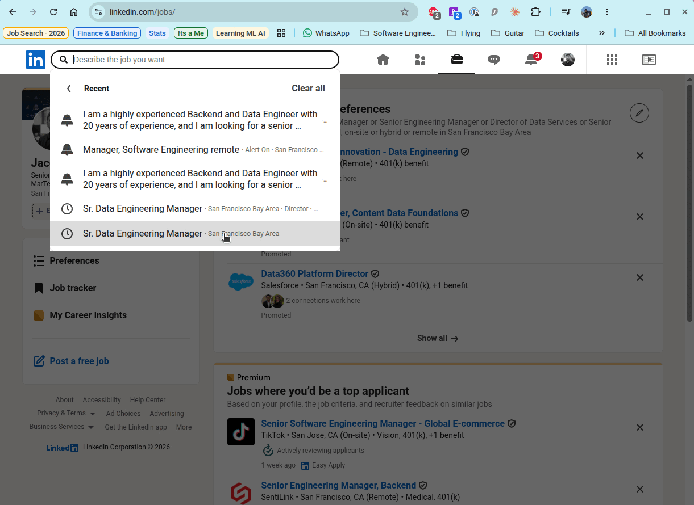
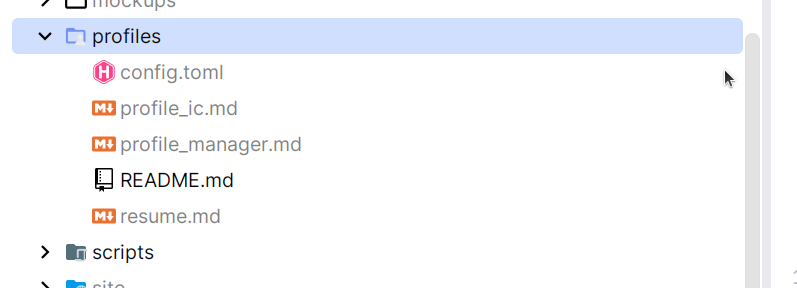

# Configuration

## Requirements

Scout is a personal, single-user tool. Before you start, make sure you have:

| Requirement | Why |
|---|---|
| **:simple-python:{ .python } Python 3.12** + [pipenv](https://pipenv.pypa.io/) | Runtime & dependency management |
| **:simple-git:{ .git } Git** | To clone the repo |
| **:simple-googlechrome:{ .chrome } Google Chrome** with the **Scout extension** (`extension/`, loaded unpacked) | Pass 1 runs from inside your own logged-in browser session |
| **:simple-claude:{ .claude } [Claude Code](https://claude.com/claude-code)** (the `claude` CLI) | Passes 2–3 run on it by default (Haiku/Sonnet); not needed if you point them at an OpenAI-compatible model instead. Pass 1 doesn't touch an LLM at all |
| **:fontawesome-brands-linkedin:{ .linkedin } A LinkedIn account** logged into Chrome | The scrape runs inside your own session, using your saved searches |
| *(Optional)* An OpenAI-compatible server (:simple-ollama: [Ollama](https://ollama.com/) etc.) | Run Passes 2–3 on that model: free and private |

## The setup journey

Four steps, done once (steps 3–4 you'll revisit as your search evolves):

<div class="st-steps" markdown>

<div class="st-step" markdown>
<div class="st-step-num">1</div>
<span class="st-step-kicker">Install</span>
### :material-download: Clone & install

```bash title="Terminal"
git clone https://github.com/abraham-jacob/scout.git && cd scout
pipenv install
```

</div>

<div class="st-step" markdown>
<div class="st-step-num">2</div>
<span class="st-step-kicker">Connect accounts</span>
### :material-puzzle:{ .chrome } Load the Scout extension & connect Claude Code

Pass 1 (the browser scrape) doesn't call an LLM at all — it's plain
JavaScript running inside your own logged-in LinkedIn tab via the **Scout
browser extension**. Passes 2–3 (cleaning and enrichment/scoring) run on
Claude by default, so you'll want Claude Code too unless you're routing them
to an OpenAI-compatible model instead.

**Load the extension:**

1. In Chrome, go to `chrome://extensions` and enable **Developer mode**
   (top right).
2. Click **Load unpacked** and select the `extension/` folder from your
   clone.
3. Make sure you're logged into LinkedIn in that same browser — the popup
   talks to your local Scout server (`http://127.0.0.1:8000`), so start the
   server (step 5 below) before using it.

{ .st-shot }

**Connect Claude Code** (skip if you're using the api backend for Passes 2–3):

!!! tip "You need a paid Claude plan"
    Claude Code requires a [subscription](https://claude.com/pricing) — the
    **$20/month Pro plan** is enough to run Scout end-to-end.

- Install the [`claude` CLI (Claude Code)](https://docs.claude.com/en/docs/claude-code/quickstart) and confirm it runs (`claude --version`).

</div>

<div class="st-step" markdown>
<div class="st-step-num">3</div>
<span class="st-step-kicker">Configure</span>
### :material-file-cog: Configure Scout

All your settings live in the `profiles/` directory. Everything under it
except its own `README.md` is git-ignored — these files hold personal data
(resume, scoring criteria, saved searches) and never leave your machine. It
holds two kinds of file, `config.toml` (this step) and markdown scoring
files (the next step).

`config.toml` is loaded and validated by `app/config.py::load_config`. It is
**required**, with no in-code defaults — a typo or missing field fails
loudly at startup instead of silently changing behavior.

A minimal config looks like this:

```toml title="TOML"
[[roles]]
name = "Manager"
definition = "Leads people. Titles like Engineering Manager, Senior EM, Director."
profile = "manager.md"          # optional per-role scoring profile in profiles/

[[linkedin_searches]]
name = "My Search"               # short alias shown in the run drawer/logs
url = "https://www.linkedin.com/jobs/search-results/?keywords=..."   # copied from LinkedIn

[filters]
exclude_companies = []          # dropped before any LLM call

[scoring]
fit_weight = 0.85               # must sum to 1 with criteria_weight
criteria_weight = 0.15
dealbreaker_cap = 30.0           # max score when a dealbreaker is present

[logging]
dir = "logs"

[llm]
backend = "claude"              # or "api" — see the OpenAI-compatible Backend page
max_workers = 4                 # Pass 2/3 parallelism
```

#### Section overview

| Section | Required | What it controls |
|---|---|---|
| `[[roles]]` | ✅ (≥1) | The role types jobs are classified into; drives prompts, scoring profiles, and UI filters |
| `[[linkedin_searches]]` | ✅ (≥1) | Named LinkedIn saved-search URLs scraped every run |
| `[filters]` | ✅ | Companies to drop before any LLM call |
| `[scoring]` | ✅ | Fit/criteria weights and the dealbreaker score cap |
| `[llm]` | ✅ | Backend (`claude` / `api`) and Pass 2/3 parallelism |
| `[llm.api]` | when `backend = "api"` | Server URL, model, API key, timeout |
| `[llm.api.clean]` / `[llm.api.enrich]` | optional | Per-pass request params merged into the api backend's chat-completion call |
| `[logging]` | ✅ | Log directory (daily app log + opt-in model-call log) |
| `[scrape]` | optional | Overall wall-clock guardrail for a run |
| `[extension]` | optional | Jitter bounds (ms) for the Scout browser extension's per-job fetch loop |

#### Define your role types — `[[roles]]`

Defines the role types Scout keeps. **At least one** role is required — with
zero roles there is nothing for Scout to keep, so the pipeline (and the web
UI) refuse to run. There are no built-in default roles.

```toml title="TOML"
[[roles]]
name = "Product Manager"
definition = """the core of the job is owning product strategy and \
execution... Examples: Product Manager, Senior/Group PM, Director of \
Product. Project/program management does not count."""
profile = "profile_pm.md"   # optional — omit to score on the resume alone
```

| Field | Required | Notes |
|---|---|---|
| `name` | ✅ | Label stored in the DB and shown in the UI. Chip/filter colors are assigned automatically in the order roles are listed |
| `definition` | ✅ | Classification guidance for the enrichment model — what counts, example titles, explicit exclusions. Jobs matching no configured role are classified `Other` and dropped |
| `profile` | optional | Markdown file in `profiles/` the role is scored against; omit to score on the resume alone |

#### Set up your :fontawesome-brands-linkedin:{ .linkedin } LinkedIn searches — `[[linkedin_searches]]` { #linkedin_searches }

Defines the LinkedIn saved-search URLs Scout scrapes every run. At least
**one** entry is required.

**To get your search URL:**

1. Go to the [LinkedIn Jobs](https://www.linkedin.com/jobs/) page.
2. In the search bar, describe the job you're looking for and apply any filters (Location, Remote, etc.).
3. Copy the URL straight from your browser's address bar.



Paste this URL into your config block:

```toml title="TOML"
[[linkedin_searches]]
name = "Some search name..."
url = "https://www.linkedin.com/jobs/search-results/?keywords=..."
```

| Field | Required | Notes |
|---|---|---|
| `name` | ✅ | Short alias shown in the run drawer/logs in place of the raw URL; must be unique (case-insensitive) |
| `url` | ✅ | The exact LinkedIn jobs-search URL; must start with `https://www.linkedin.com/` |

!!! tip "You can add more than one"
    Repeat the `[[linkedin_searches]]` block for every saved search you
    want — every configured search is scraped on every run, there's no need
    to pick just one. Re-scraping the same search repeatedly is safe: jobs
    already in the database are dropped before any LLM call, so nothing is
    double-processed or double-billed.

#### Filter out companies — `[filters]`

Companies to drop before spending any LLM call on their jobs.

```toml title="TOML"
[filters]
exclude_companies = ["Capital One"]   # dropped before any LLM call; [] is fine
```

| Field | Required | Notes |
|---|---|---|
| `exclude_companies` | ✅ | Company names dropped before any LLM call; `[]` is fine |

#### Weight the match score — `[scoring]`

Controls how fit and criteria combine into the final match score, and the
penalty applied when a dealbreaker is hit.

Pass 3 produces two 0–100 subscores per job: `fit_score` (how well your
**resume** and role profile match what the job asks for) and `criteria_score`
(how well the job satisfies your **`criteria.md`** — workplace, compensation,
domains, company preferences — independent of resume fit). The final
`match_score` shown in the UI is a weighted sum of the two:

```
match_score = fit_weight * fit_score + criteria_weight * criteria_score
```

If a job has no `criteria_score` (no `criteria.md` configured), the match
score is `fit_score` alone. If the model flagged any dealbreakers on the job,
the score is then capped at `dealbreaker_cap`, no matter how high the
weighted sum came out.

```toml title="TOML"
[scoring]
fit_weight = 0.85        # weights must sum to 1
criteria_weight = 0.15
dealbreaker_cap = 30.0   # score ceiling (0-100) when a dealbreaker is hit
```

| Field | Required | Notes |
|---|---|---|
| `fit_weight` | ✅ | Weight applied to `fit_score` in the final match score; must sum to 1 with `criteria_weight` |
| `criteria_weight` | ✅ | Weight applied to `criteria_score` in the final match score; must sum to 1 with `fit_weight` |
| `dealbreaker_cap` | ✅ | Score ceiling (0–100) applied when the job has any dealbreakers, regardless of the weighted fit/criteria sum |

!!! info ""
    - **New scrape runs** score automatically.
    - **Existing jobs**: run `pipenv run python -m scripts.backfill_scores`
      (one Sonnet call per unscored job; updates only the scoring columns).
    - **Changed your mind about weights or the cap?**
      `pipenv run python -m scripts.backfill_scores --recompute` rebuilds every
      final score from the stored subscores with zero LLM calls.

#### Pick the backend & its parallelism — `[llm]`

Selects which backend runs Passes 2–3 (description cleaning and
enrichment/scoring), and how wide their worker pool runs. Pass 1 (the
browser scrape) isn't affected — it never calls an LLM at all.

```toml title="TOML"
[llm]
backend = "claude"
max_workers = 4
```

| Field | Required | Notes |
|---|---|---|
| `backend` | ✅ | `"claude"` or `"api"` — no default, so the config always states which one is in use. Only Passes 2–3 move; Pass 1 (the browser scrape) doesn't call an LLM at all, so there's nothing to route there |
| `max_workers` | ✅ | Width of the Pass 2/3 worker pool. Claude can go wide (bounded mainly by prompt-cache-write dedup, default 2); an api-backend server is bounded by its own VRAM/throughput — a 16GB box running a 20B model may only manage `max_workers = 1` |

??? note ":material-server-network: Routing Passes 2–3 to an OpenAI-compatible endpoint — `[llm.api]`"

    !!! warning
        Configuring an OpenAI-compatible server is outside the scope of this manual.

    Set `backend = "api"` to route both headless passes to any
    **OpenAI-compatible chat-completions endpoint** — local (e.g.
    [Ollama](https://ollama.com)) or remote — cutting Claude API cost for
    them. It's all-or-nothing: both passes move together.

    ```toml title="TOML"
    [llm]
    backend = "api"
    max_workers = 1                             # local box; keep it low

    [llm.api]
    base_url = "http://192.168.1.50:11434/v1"   # your server's OpenAI-compatible endpoint
    model    = "scout-enrich:latest"             # EXACT id from the server's model list
    # api_key = "ollama"    # optional; Ollama ignores it, other servers may need it
    # timeout = 300         # optional, seconds (default 300) — inference can be slow
    ```

    | Field | Required | Notes |
    |---|---|---|
    | `base_url` | ✅ | Your server's OpenAI-compatible endpoint |
    | `model` | ✅ | Exact id from the server's model list — copy it verbatim, including any tag (Ollama: `name:tag`, e.g. `scout-enrich:latest`; `scout-enrich` alone won't match) |
    | `api_key` | optional | Ignored by Ollama; other servers may require it |
    | `timeout` | optional | Seconds, default `300` — inference can be slow |

    At startup the pipeline probes the server and refuses to run if it's
    unreachable or isn't serving that exact `model` id — a wrong host, a
    stopped server, or a mistyped/un-pulled model fails fast instead of
    mid-run, and the error prints the ids the server actually serves.

??? note ":material-tune-variant: Per-pass request parameters (optional) — `[llm.api.clean]` / `[llm.api.enrich]`"

    Two optional sub-tables let you pass request parameters to the server
    per pass — `[llm.api.clean]` for description cleaning (Pass 2) and
    `[llm.api.enrich]` for enrichment/scoring (Pass 3). Each key/value is
    merged **verbatim** into that pass's chat-completion JSON, so you can
    set anything the server accepts. The motivating case is a reasoning
    model like GPT-OSS: give the mechanical cleaning pass low effort and the
    scoring pass high effort.

    ```toml title="TOML"
    [llm.api.clean]
    temperature = 0
    reasoning_effort = "low"      # cleaning is mechanical — don't burn thinking on it

    [llm.api.enrich]
    temperature = 0
    reasoning_effort = "high"     # scoring is judgment — let it think
    ```

    Both tables are optional, as is every key inside them. Omit them and the
    pipeline sends only JSON-output mode — temperature and any reasoning
    knob fall back to the **server/model default** (Scout doesn't force
    `temperature = 0`; set it explicitly here if you want it). Values must
    be scalars (string/number/boolean). The pipeline owns `model`,
    `messages`, and `stream`, so those keys are rejected here. Parameter
    *values* aren't validated — an unsupported one (a `reasoning_effort` a
    non-reasoning model doesn't understand, say) is left for the server to
    reject.

!!! info "See also"
    [OpenAI-compatible Backend](openai-compatible-backend.md) has the full picture, including
    warm-up and retry behavior.

#### Set the log directory — `[logging]`

Where Scout writes its daily app log, and the opt-in model-call log.

```toml title="TOML"
[logging]
dir = "~/.local/state/scout/logs"   # daily app log + opt-in model-call log;
                                    # ~ expands, relative paths = project root
```

| Field | Required | Notes |
|---|---|---|
| `dir` | ✅ | Daily app log + opt-in model-call log; `~` expands, relative paths are project-root-relative |

#### Set a run timeout — `[scrape]`

Optional. The overall wall-clock guardrail for a run.

```toml title="TOML"
[scrape]
run_timeout_minutes = 30
```

| Field | Required | Notes |
|---|---|---|
| `run_timeout_minutes` | optional | Overall wall-clock guardrail for a run; default 30 |

#### Tune the extension's fetch jitter — `[extension]`

Optional — omit unless you've changed the defaults. Jitter bounds for the
Scout browser extension's per-job Voyager fetch loop.

```toml title="TOML"
[extension]
min_delay_ms = 3000
max_delay_ms = 8000
```

| Field | Required | Notes |
|---|---|---|
| `min_delay_ms` / `max_delay_ms` | optional | Jitter bounds (ms) for the extension's per-job fetch loop; defaults to 3000/8000 |

</div>

<div class="st-step st-step--keep-line" markdown>
<div class="st-step-num">4</div>
<span class="st-step-kicker">Configure</span>
### :material-file-document: Scoring files

Once Scout classifies a scraped job into one of your roles, it uses an LLM to evaluate how well that job matches you. To do this accurately, Scout needs to know about your background and what you're looking for. This is where your scoring files come in.

| File | Contents |
|---|---|
| `resume.md` | **Required.** Your latest resume, converted to markdown / plain text. |
| `profile_<role>.md` | **Optional**, one per role (referenced from `config.toml`): what you are looking for in that kind of role — level, kind of work, technologies, scope. Jobs of a role with no profile are scored against the resume alone. |
| `criteria.md` | **Optional.** Preferences outside the resume: workplace, compensation, domains to seek/avoid, company stage. Drives the `criteria_weight` share of the final score (the rest is resume+profile fit). Without this file the score is 100% fit. |

#### Resume :material-file-document: `resume.md` (Required)
At the core of this process is your `resume.md`. This file is required (the pipeline will refuse to start without it) because it acts as the baseline for evaluating your fit for any position.

??? example "Example `resume.md`"

    ```markdown title="Markdown"
    # John Doe
    **Senior Engineering Manager | Data Platforms, Experimentation & Personalization**  
    +1 (555) 123 4567 | john.doe@example.com | [linkedin.com/in/johndoe](https://linkedin.com/in/johndoe)
    
    ---
    
    ## Summary
    Senior data engineering leader with 15+ years building and scaling high-throughput enterprise data platforms and petabyte-scale pipelines. Track record of delivering the core infrastructure, across both event-driven and batch systems, that powers analytics, experimentation, and machine learning for marketing and product decisions.
    
    ---
    
    ## Core Competencies & Technical Skills
    *   **Leadership & Practice:** Engineering Leadership, People & Performance Management, Hiring & Mentorship, Technical Strategy & Roadmap.
    *   **Domains:** Marketing Technology, Experimentation & A/B Testing, Recommendation & Personalization.
    *   **Cloud & Infrastructure:** AWS (Fargate, Lambda, S3, DynamoDB, Glue, SQS, RDS, Batch), Docker.
    *   **Data Engineering & Storage:** Snowflake, Delta Lake, Apache Spark, Airflow, Redis, MySQL.
    *   **Languages & AI:** Python, SQL, Jupyter Notebooks, GenAI / RAG.
    
    ---
    
    ## Professional Experience
    
    ### Global Finance Corp 
    **Sr. Manager, Enterprise Data Platform (Marketing Technology)** | *2024 - 2026*
    Owned technical strategy and execution for the enterprise data platform governing personalization, experimentation, and feature-flag telemetry. Led a team of 8 to 10 engineers delivering highly targeted user experiences and real-time release observability across web and mobile.
    *   **Full-Funnel Experimentation Architecture:** Scaled hybrid real-time and batch pipelines to process 800 million daily events...
    
    ### Alpha Beta Hedge Fund
    **Tech Lead** | *2015 - 2019*
    *   **Data Infrastructure Modernization:** Transformed legacy ETL feeds and data processing infrastructure into a robust signal-generation pipeline, reducing latency for daily trade-list generation and supporting quantitative trading operations.
    
    ---
    
    ## Education
    *   **Bachelor of Science, Computer Science** | State University
    ```

#### Role profiles :material-file-document: `profile_<role>.md` (Optional)
Specific requirements for a particular type of job (e.g., what you want out of a Manager role might be different from an Individual Contributor role).

??? example "Example `profile_manager.md`"

    ```markdown title="Markdown"
    # Professional Candidate Profile: John Doe
    **Target Focus:** Engineering Manager, Senior Engineering Manager, Director / Data Platforms & Distributed Infrastructure Leader
    
    ---
    
    ## Executive Summary
    Highly technical, systems-oriented Engineering Manager and Architect with over 15 years of experience building and scaling petabyte-scale data infrastructure, real-time event streaming systems, and enterprise instrumentation platforms.
    
    ---
    
    ## 1. Core Managerial & Leadership Competencies
    *   **Engineering Leadership & Strategy:** Experience defining multi-year technical strategies and engineering roadmaps for business-critical enterprise data platforms.
    *   **People Management & Talent Growth:** Directed teams of 8–10 engineers, managed sprint planning, set engineering delivery velocity, and directly guided reports through career progression and promotions.
    
    ---
    
    ## 2. Granular Managerial Experience & Quantified Impact
    
    ### Enterprise Platform Strategy & Scalability (Sr. Manager Level)
    *   **High-Throughput Stream Ingestion:** Directly owned the technical execution and delivery of telemetry pipelines processing **800 Million daily events**.
    *   **Tooling Consolidation & Financial Governance:** Championed the migration and unification of fragmented experimentation and feature-flag software layers into a single consolidated platform.
    
    ### Decentralization & Business Value Generation (Manager Level)
    *   **Self-Serve Data Infrastructure Architecture:** Conceptualized and built a self-serve analytics framework that decoupled application event definition from core engineering release cycles.
    ```

#### General criteria :material-file-document: `criteria.md` (Optional)
Broad preferences that apply to any job, like compensation, location, or hard dealbreakers. Mark any criteria line as a hard veto by prefixing it with `**DEALBREAKER**:` — jobs violating one are capped at `dealbreaker_cap` no matter how well they fit, and the violated item is shown on the job card.

??? example "Example `criteria.md`"

    ```markdown title="Markdown"
    ## Workplace
    - Remote strongly preferred; Hybrid up to 2 days is fine
    - **DEALBREAKER**: On-site 4+ days a week
    
    ## Domains to avoid
    - Ad Tech (soft penalty)
    - **DEALBREAKER**: Crypto / Web3
    ```

</div>

</div>

## Final Check

!!! warning "Important"
    Once you've set up your configuration and scoring files, your
    `profiles/` directory should look something like this:

    

From here: read [Using Scout](web-ui.md) to launch Scout and see what a
run produces, or [Architecture](architecture.md) for how the pipeline works
under the hood.
