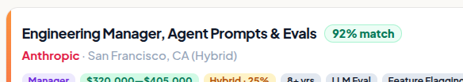
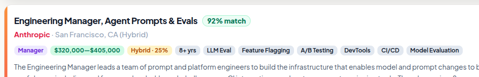
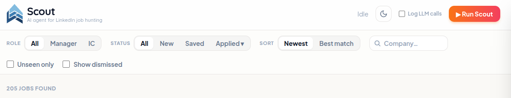

---
hide:
  - toc
---

{ .st-logo }
{ .st-logo }

# Know which jobs are worth your time. { .st-title }

Scout scrapes every posting behind your LinkedIn searches, then classifies,
summarizes, and scores each one against your résumé — locally.

[Get started :material-arrow-right:](getting-started.md){ .md-button .md-button--primary }
[:fontawesome-brands-github: View on GitHub](https://github.com/abraham-jacob/scout){ .md-button }

{ .st-shot }
{ .st-shot }

## How it works

1
**Scrape**
Drives real Chrome to pull every job behind each saved search.

2
**Clean & classify**
Strips boilerplate, sorts each role into your categories.

3
**Score**
Rates every job out of 100 against your résumé & criteria.

## What you get

-   :material-target: __A match score, 0–100__

    ---

    Every job scored against your résumé, profile, and dealbreakers.

    

-   :material-tag-multiple: __Auto-tagging & summaries__

    ---

    A 2–4 sentence summary and tags on every card — no more scrolling boilerplate.

    

-   :material-filter-variant: __Sort & filter__

    ---

    By role, score, company, status. Find the good ones fast.

    

-   :material-shield-lock: __Runs on your machine__

    ---

    Your data stays local. Bring :simple-claude:{ .claude } Claude, or a
    fully local model via :simple-ollama: Ollama.

## Why I built this

I built Scout during my own job search. Every morning started with a stack of
LinkedIn alert emails, and every posting meant the same ritual: open it,
scroll past three paragraphs of EEO boilerplate, figure out if it's a real
match, check whether I'd already seen it last week under a different posting
ID. After a few weeks I realized I was doing the same mechanical
classification task hundreds of times — which is exactly the kind of task
you should hand to an agent. So I did.

## Explore the docs

- **[Configuration](getting-started.md)** — requirements, setup walkthrough, and the full `config.toml`/scoring-file reference
- **[Using the Web UI](web-ui.md)** — filtering, job cards, match scores, the application pipeline
- **[OpenAI-compatible Backend](openai-compatible-backend.md)** — run Passes 2–3 on Ollama or any other OpenAI-compatible server, local or remote
- **[Architecture](architecture.md)** — how the three-pass pipeline actually works
- **[Contributing](contributing.md)** — conventions for working on Scout itself
- **[FAQ / Troubleshooting](faq.md)**

---

Made with ❤️ by Jacob Abraham. If Scout helped you land your next role,
consider supporting the project ☕.

[Source on GitHub](https://github.com/abraham-jacob/scout) ·
[MIT License](https://github.com/abraham-jacob/scout/blob/main/LICENSE) © 2026 Jacob Abraham
