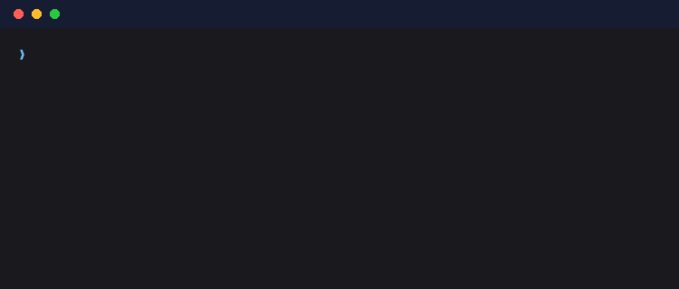

# Using the Web UI

It's a single-user, local-only FastAPI + HTMX app — no login, no network
exposure, just a job list and a **▶ Run Scout** button.

<div class="st-steps st-steps--loose" markdown>

<div class="st-step" markdown>
<div class="st-step-num" markdown="span">:material-console:</div>
<span class="st-step-kicker">Start</span>
### Launch the server

Start the UI by running the following command in your terminal:

```bash
pipenv run uvicorn app.main:app        # http://127.0.0.1:8000
```

{ .st-shot }

This spins up the local FastAPI web server.

</div>

<div class="st-step" markdown>
<div class="st-step-num" markdown="span">:material-play:</div>
<span class="st-step-kicker">Execute</span>
### Run Scout

Click { style="height: 1.8em; vertical-align: middle; border-radius: 0.25rem;" }
to launch the pipeline as a subprocess. It streams live progress into a "run
drawer" — per-pass timers, live *N of M* counts, which model is doing what,
and a scrolling event log of every job's outcome.

{ .st-shot }

</div>

<div class="st-step" markdown>
<div class="st-step-num" markdown="span">:material-filter-variant:</div>
<span class="st-step-kicker">Discover</span>
### Filter and Sort

Filter by role type, application status, unseen-only, or company name with
autocomplete search. Sort by newest or best match.

{ .st-shot }

</div>

<div class="st-step" markdown>
<div class="st-step-num" markdown="span">:material-card-text-outline:</div>
<span class="st-step-kicker">Browse</span>
### Job cards

Every card surfaces what matters at a glance — title, company, location,
salary range, and how it was posted (new vs. repost) — with the full
original description one click away.

{ .st-shot }

</div>

<div class="st-step" markdown>
<div class="st-step-num" markdown="span">:material-text-box-search:</div>
<span class="st-step-kicker">Review</span>
### Read Summaries & Tags

No more scrolling past boilerplate. Every job gets a clean 2–4 sentence
summary of the actual role, generated after the noise (EEO statements,
benefits marketing, "About the Company" filler) is stripped out.

{ .st-shot }

Each job is also tagged with the details you'd otherwise dig for: workplace
type, salary band, tech stack, team size, seniority.

{ .st-shot }

</div>

<div class="st-step" markdown>
<div class="st-step-num" markdown="span">:material-target:</div>
<span class="st-step-kicker">Decide</span>
### Match score

Every job is scored 0–100 against your resume, an optional per-role
profile, and your hard criteria — with dealbreakers (like an unacceptable
commute or on-site requirement) capping the score regardless of how good the
rest of the fit is. See [Configuration](getting-started.md) for how to define
dealbreakers.

{ .st-shot }

</div>

<div class="st-step" markdown>
<div class="st-step-num" markdown="span">:material-cursor-default-click:</div>
<span class="st-step-kicker">Action</span>
### Apply and Track

**Fast, Direct Applications**  
Every card unwraps LinkedIn's redirect links and points straight to the
fastest path to apply — whether that's the company's own site or Easy Apply.

{ .st-shot }

**Pipeline Tracking**  
Never lose track of where you stand. The status dropdown lets you move the
job through the entire interview pipeline (New → Applied → Interviewing →
Offer) right from its card.

{ .st-shot }

</div>

</div>
