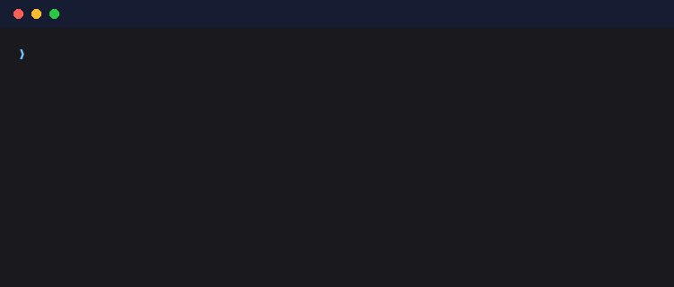
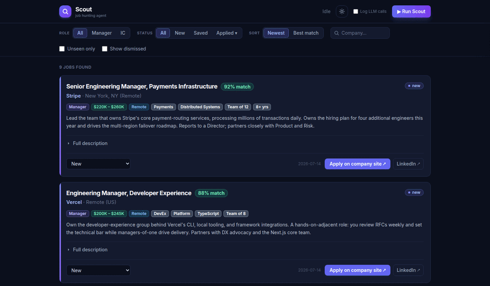

# Using Scout

It's a single-user, local-only FastAPI + HTMX app — no login, no network
exposure. Scraping is triggered from **Scout's Chrome extension**, not a
button in this UI; the web UI is purely for browsing, filtering, and
tracking the jobs a run finds.

<div class="st-steps st-steps--loose" markdown>

<div class="st-step" markdown>
<div class="st-step-num" markdown="span">:material-console:</div>
<span class="st-step-kicker">Start</span>
### Launch the server

Start the UI by running the following command in your terminal:

```bash
pipenv run uvicorn app.main:app        # http://127.0.0.1:8000
```

{ .st-shot }

This spins up the local FastAPI web server.

</div>

<div class="st-step" markdown>
<div class="st-step-num" markdown="span">:material-play:</div>
<span class="st-step-kicker">Execute</span>
### Run Scout from the extension

Click the **Scout icon** in Chrome's toolbar (see [Configuration](getting-started.md)
for loading the extension). Every run — however it's started — streams live
into Scout's Chrome extension: Pass 1's harvest, then Pass 2/3 enrichment,
through to a saved-jobs summary. While a run is happening, this web UI shows
a lightweight status strip so it doesn't look stale, but the detailed live
log always lives in the extension.

Scout's Chrome extension gives you three ways to start a run:

- **Saved Searches** — run a search from your config
- **Custom Search** — scrape any pasted URL or job id, ad hoc
- **Scrape Current Page** — harvest whatever LinkedIn jobs page is already open

{ .st-shot }

#### Saved Searches

Lists every `[[linkedin_searches]]` entry from your `config.toml`, each with
its own **Run** button — click one to scrape just that search. The list is
read through the running web server, so it's cached for the server's
lifetime; if you edit `config.toml` afterward, click the **reload** icon
next to the section title to re-read the file without restarting the server.

#### Custom Search

Paste any LinkedIn job URL or bare job id into the box and click **Run** to
scrape it ad hoc, without adding it to your config. Accepts a search-results
URL, a single `/jobs/view/<id>` link, or just the numeric job id — Scout's
Chrome extension classifies what you pasted and routes it accordingly,
entirely client-side.

{ .st-shot }

<div class="st-small-table" markdown>

| Input | Example |
|---|---|
| Search-results URL | `https://www.linkedin.com/jobs/search-results/?keywords=product%20manager` |
| Single-job URL | `https://www.linkedin.com/jobs/view/4123456789/` |
| Bare job id | `4123456789` |

</div>

#### Scrape Current Page

Harvests whatever LinkedIn jobs page is already open in your active Chrome
tab — handy for a one-off search you haven't saved. Requires a LinkedIn jobs
page to be open in the browser; the button stays disabled otherwise.

</div>

<div class="st-step" markdown>
<div class="st-step-num" markdown="span">:material-filter-variant:</div>
<span class="st-step-kicker">Discover</span>
### Filter and Sort

Filter by role type, application status, unseen-only, or company name with
autocomplete search. Sort by newest or best match.

{ .st-shot }

</div>

<div class="st-step" markdown>
<div class="st-step-num" markdown="span">:material-card-text-outline:</div>
<span class="st-step-kicker">Browse</span>
### Job cards

Every card surfaces what matters at a glance — title, company, location,
salary range, and how it was posted (new vs. repost) — with the full
original description one click away.

{ .st-shot }

</div>

<div class="st-step" markdown>
<div class="st-step-num" markdown="span">:material-text-box-search:</div>
<span class="st-step-kicker">Review</span>
### Read Summaries & Tags

No more scrolling past boilerplate. Every job gets a clean 2–4 sentence
summary of the actual role, generated after the noise (EEO statements,
benefits marketing, "About the Company" filler) is stripped out.

{ .st-shot }

Each job is also tagged with the details you'd otherwise dig for: workplace
type, salary band, tech stack, team size, seniority.

{ .st-shot }

</div>

<div class="st-step" markdown>
<div class="st-step-num" markdown="span">:material-target:</div>
<span class="st-step-kicker">Decide</span>
### Match score

Every job is scored 0–100 against your resume, an optional per-role
profile, and your hard criteria — with dealbreakers (like an unacceptable
commute or on-site requirement) capping the score regardless of how good the
rest of the fit is. See [Configuration](getting-started.md) for how to define
dealbreakers.

{ .st-shot }

</div>

<div class="st-step" markdown>
<div class="st-step-num" markdown="span">:material-cursor-default-click:</div>
<span class="st-step-kicker">Action</span>
### Apply and Track

**Fast, Direct Applications**  
Every card unwraps LinkedIn's redirect links and points straight to the
fastest path to apply — whether that's the company's own site or Easy Apply.

{ .st-shot }

**Pipeline Tracking**  
Never lose track of where you stand. The status dropdown lets you move the
job through the entire interview pipeline (New → Applied → Interviewing →
Offer) right from its card.

{ .st-shot }

</div>

</div>
